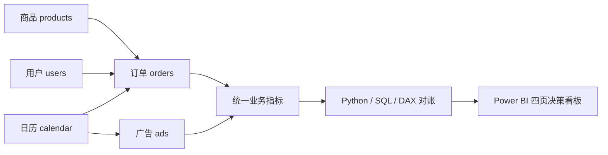

# 电商运营分析助手：项目完整说明（V1.2）

## 1. 项目概览

**Ecommerce Operations Analytics Assistant** 是一个可复现、平台无关的电商运营分析作品集项目。项目围绕台湾女性消费品模拟业务，贯通数据生成、数据建模、SQL/Python 分析、Power BI 语义模型、商业看板和自动化验证，用于回答商品、经营、客户和广告四类核心决策问题。

项目不是单纯的可视化演示，而是一套完整的分析交付：

- 数据层：固定随机种子的合成数据，保证结果可复现。
- 建模层：商品、用户、订单、广告和日历组成的分析模型。
- 指标层：统一 GMV、净销售额、毛利、复购率、CPA、ROAS 等业务口径。
- 分析层：Python、SQL 与 DAX 三套实现交叉对账。
- 展示层：面向管理层和非技术人员的四页 Power BI 决策看板。
- 质量层：数据质量、指标一致性、PBIX/PBIR/TMDL 和截图规格自动化测试。

> 项目中的业务数据均为模拟数据，仅用于展示分析方法，不代表真实 Shopee、真实店铺或真实市场表现。

## 2. 项目希望解决的问题

项目把运营问题归纳为四个管理层最关心的问题：

1. **经营结果**：今年赚了多少钱，销售和利润来自哪里，下一步关注什么？
2. **商品机会**：哪些商品和品类值得继续投入，哪些需要优化或观察？
3. **用户价值**：哪些客户最有价值，哪些客户存在流失风险？
4. **广告回报**：每一元广告费带来多少归因收入，预算应该投向哪里？

V1.2 的看板统一使用以下阅读顺序：

```text
一句话业务结论 → 核心 KPI → 原因证据 → 下一步行动
```

目标是让管理者在十秒内理解结果、原因和行动方向，而不是面对一组缺少解释的数据图表。

## 3. 数据与业务范围

### 3.1 数据规模

默认 pipeline 生成以下 FY2025 数据：

| 数据表 | 行数 | 主要用途 |
|---|---:|---|
| products | 800 | 商品、品类、价格、成本、评分、评论、热度与机会分 |
| users | 12,000 | 注册用户、地区、获客渠道和 RFM 属性 |
| orders | 60,000 | 订单状态、金额、折扣、成本、销售额与利润 |
| ads | 2,190 | 日期、活动、渠道、曝光、点击、转化、花费和归因收入 |
| calendar | 365 | FY2025 日期、月份、季度等时间维度 |

数据由固定种子 `20260801` 生成，因此每次重新运行都可以得到相同的规模、业务分布和 KPI 结果。

### 3.2 数据模型



商品、用户和日历作为维度，订单与广告承担事实数据。统一指标层使相同口径可以被 Python 分析、SQL 查询和 Power BI DAX 共同使用。

## 4. 核心指标口径

| 指标 | 计算方式 | 业务口径 |
|---|---|---|
| GMV | `SUM(gross_amount)` | 包含 completed 和 refunded，排除 cancelled |
| 净销售额 | `SUM(net_sales)` | 仅 completed 订单，扣除折扣后金额 |
| 有效订单量 | `DISTINCTCOUNT(order_id)` | 仅 completed 订单 |
| 毛利 | 净销售额 − 成本 | 仅 completed 订单 |
| 毛利率 | 毛利 ÷ 净销售额 | 净销售额为零时返回空值或零 |
| AOV | 净销售额 ÷ 有效订单量 | 每笔 completed 订单的平均 TWD 金额 |
| 购买用户数 | completed 订单中的去重用户数 | 随筛选上下文变化 |
| 复购率 | 至少两笔 completed 订单的用户 ÷ 购买用户 | 固定分析窗口：2025-01-01 至 2025-12-31 |
| CTR | 点击量 ÷ 曝光量 | 使用加权汇总，不平均每日 CTR |
| CVR | 转化量 ÷ 点击量 | 使用加权汇总 |
| CPA | 广告花费 ÷ 转化量 | TWD/归因转化 |
| ROAS | 归因收入 ÷ 广告花费 | 收入倍数，不等于利润或因果增量 |

V1.2 保留 V1.1 的全部 **37 个基础度量值**，并新增 **21 个展示性度量值**，总计 58 个。新增度量只负责动态结论、行动建议和紧凑金额展示，没有修改原有业务指标公式。

## 5. FY2025 默认视图结果

| KPI | 结果 |
|---|---:|
| GMV | TWD 39,295,789.00 |
| 净销售额 | TWD 35,169,616.30 |
| 有效订单量 | 55,890 |
| 毛利 | TWD 14,339,912.83 |
| 毛利率 | 40.7736% |
| AOV | TWD 629.2649 |
| 购买用户数 | 11,381 |
| 复购率 | 89.6143% |
| CTR | 3.2688% |
| CVR | 7.6213% |
| CPA | TWD 93.0594 |
| ROAS | 7.9159x |

这些结果分别通过 Python、SQL、DAX 和最终 PBIX 进行核对。V1.2 与 V1.1 的十二项验收 KPI 完全一致。

## 6. Power BI 四页看板

### 6.1 经营总览


**业务问题：今年赚了多少钱，增长来自哪里，下一步应该关注什么？**

页面重点：

- 第一层显示可随筛选变化的一句话经营结论。
- 四个主 KPI 为净销售额、毛利、毛利率和 ROAS。
- GMV、订单量、AOV、购买用户数和复购率放入次级信息区。
- 主图展示 1—12 月 GMV 与净销售额趋势。
- 右侧比较品类净销售额和毛利贡献，并按净销售额排序。
- 底部把计算结果转成“继续加码、重点观察、优化处理”三类行动。

默认视图表明：净销售额为 35.17M TWD，毛利为 14.34M TWD，毛利率为 40.8%，广告 ROAS 为 7.92x。动态文案还会识别净销售额贡献第一的品类、毛利率最低的品类，以及 GMV 与净销售额之间的差额。

### 6.2 商品机会


**业务问题：哪些商品和品类值得继续投入？**

页面重点：

- 核心 KPI 为商品数量、高机会商品数量、有效销量、净销售额和毛利。
- 机会矩阵使用 Opportunity Score 作为横轴、Hot Score 作为纵轴。
- 气泡大小表示净销售额，颜色表示品类。
- 保留价格带净销售额与毛利分析。
- 商品排名不只展示 Top 10，还输出“值得加码、需要优化、继续观察”。

原始数据没有一个独立、可直接审计的“竞争程度”字段，因此 V1.2 没有为了视觉效果伪造该字段。Opportunity Score 内含基于品类商品数和品类/价格带密度的竞争代理，但看板明确采用“机会分 × 热度分”表达，并在页面和文档中说明限制。

### 6.3 用户价值


**业务问题：哪些客户最有价值，哪些客户存在流失风险？**

页面重点：

- 核心 KPI 为购买用户数、复购率、平均 Recency、Frequency 和 Monetary。
- 客群规模用于判断覆盖范围，净销售额贡献用于判断价值。
- 地区分布降为辅助信息，避免抢占客户价值主线。
- RFM 客群与业务动作直接对应。

| RFM 客群 | 建议动作 |
|---|---|
| Champions | 重点维护 |
| Potential Loyalists | 促进复购 |
| New & Promising | 首购培育 |
| At Risk | 流失召回 |
| Hibernating | 低成本唤醒 |

V1.1 中存在无名称的空白 RFM 客群。排查发现，这些记录是没有 completed 购买的注册用户，因此无法得到完整 RFM 分值。V1.2 没有删除或隐藏这些用户，而是在 Power Query 展示层增加 `RFM Segment Display`，将其明确标记为“未购买 / 未分群”，同时加入 `RFM Business Action`。

### 6.4 广告回报


**业务问题：每一元广告费带来多少收入，预算应该投向哪里？**

页面重点：

- 核心 KPI 为广告花费、归因收入、ROAS、CPA、CTR 和 CVR。
- 月度广告花费与归因收入采用独立双轴组合图。
- 活动效率图使用花费作为横轴、ROAS 作为纵轴、转化量作为气泡大小、渠道作为颜色。
- ROAS、CTR、CVR 不再共用同一纵轴，避免百分比指标因量纲差异不可见。
- 底部动态识别建议增加、继续观察和建议减少预算的渠道。

默认视图显示：每 1 TWD 广告花费带来 7.92 TWD 归因收入；CRM 的 ROAS 为 18.76x。预算结论同时参考 ROAS、CPA 和转化量，而不是只看单一指标。

## 7. V1.2 相比 V1.1 的主要升级

| 维度 | V1.1 | V1.2 |
|---|---|---|
| 阅读方式 | 以数据图表展示为主 | 结论 → KPI → 证据 → 行动 |
| 页面定位 | 偏分析人员 | 面向老板、客户和非技术人员 |
| 经营总览 | 多个 KPI 平铺 | 四项核心 KPI + 次级信息 + 行动卡 |
| 商品分析 | 排名和分数展示 | 机会矩阵 + 价格带 + 决策分类 |
| 用户分析 | 技术性 R/F/M 信息较多 | 客群规模、价值、风险和业务动作 |
| 空白 RFM | 存在无名称客群 | 查明根因并标记“未购买 / 未分群” |
| 广告指标 | ROAS、CTR、CVR 共轴 | 独立 KPI + 合理双轴 + 效率气泡图 |
| 导航 | 页面标签为主 | 四页统一原生导航，当前页高亮 |
| 筛选恢复 | 不统一 | 原生清除筛选按钮 |
| 文案 | 静态标题为主 | 基于筛选上下文的动态结论与行动 |
| 截图质量 | 存在标题或数字拥挤 | 统一 1440×810，无编辑界面和截断 |

## 8. 动态商业叙事的实现方式

动态文本不是人工写死的结论，而是由 DAX 在当前筛选上下文中计算：

- 使用 `ALLSELECTED` 保留用户当前选择。
- 使用 `TOPN` 找出净销售额、机会分、ROAS 或毛利率的最高/最低对象。
- 使用 `FORMAT` 将计算结果转成面向业务的 TWD、M、K、百分比或倍数文本。
- 仅在存在明确排序、差值或筛选依据时使用“第一、最低、建议增加”等比较表达。
- 清除筛选后恢复 FY2025 默认完整视图。

示例逻辑：

```text
当前筛选品类
    ↓
计算各品类净销售额
    ↓
TOPN 选出贡献第一品类
    ↓
生成“继续加码｜品类：净销售额 X.XXM，第一。”
```

## 9. 交互与视觉规范

- 页面尺寸：1440 × 810，16:9。
- 页面背景：`#F6F8FB`；卡片背景：`#FFFFFF`。
- 主文字：`#16324F`；主数据蓝：`#2F80ED`。
- 正向/利润：`#16A6A1`；提醒：`#F2B84B`；风险：`#E7685D`。
- 中文字体优先 Microsoft YaHei，英文和数字使用 Segoe UI。
- 不使用渐变、3D 图表、饼图、装饰性插画或第三方视觉对象。
- 四页顶部统一导航：经营总览、商品机会、用户价值、广告回报。
- 日期、品类和地区在适用页面同步；用户获客渠道和广告投放渠道因业务含义不同，不强制同步。
- tooltip 仅保留对决策有帮助的收入、利润、效率和转化信息。
- 每页统一显示“模拟数据 · TWD · FY2025”和作品集数据免责声明。

主题文件：[`dashboard/powerbi_theme/executive_storytelling_v1.2.json`](dashboard/powerbi_theme/executive_storytelling_v1.2.json)

## 10. 技术实现

### 10.1 技术栈

- Python 3.12
- pandas、NumPy
- MySQL 8 SQL
- SQLite 可执行验证
- Power BI Desktop
- PBIP、PBIR、TMDL
- Power Query M、DAX
- HTML、CSS、JavaScript
- Python unittest
- Git

### 10.2 数据到看板的流程

```text
固定种子模拟数据 / 合规采集框架
                ↓
products · users · orders · ads · calendar
                ↓
数据质量检查与星型模型
                ↓
Python 分析 + SQL 验证 + DAX 指标层
                ↓
KPI 对账
                ↓
Power BI 商业叙事看板
                ↓
PBIX、PBIP/PBIR/TMDL、截图、设计报告和测试
```

### 10.3 Power BI 文件

- 最终 PBIX：[`dashboard/powerbi_project/Ecommerce-Operations-Analytics-Assistant-v1.2.pbix`](dashboard/powerbi_project/Ecommerce-Operations-Analytics-Assistant-v1.2.pbix)
- V1.1 基线：[`dashboard/powerbi_project/Ecommerce-Operations-Analytics-Assistant-v1.1.pbix`](dashboard/powerbi_project/Ecommerce-Operations-Analytics-Assistant-v1.1.pbix)
- PBIP 入口：[`dashboard/powerbi_project/Ecommerce-Operations-Analytics-Assistant.pbip`](dashboard/powerbi_project/Ecommerce-Operations-Analytics-Assistant.pbip)
- PBIR/TMDL 生成脚本：[`dashboard/powerbi_project/generate_pbir_report_v1_2.ps1`](dashboard/powerbi_project/generate_pbir_report_v1_2.ps1)
- 详细设计报告：[`reports/powerbi_design_v1.2.md`](reports/powerbi_design_v1.2.md)

## 11. 项目目录

```text
Ecommerce-Operations-Analytics-Assistant/
├─ crawler/                 合规公共数据采集框架
├─ data/                    固定种子数据生成与样本
├─ database/                MySQL 建模、加载和业务 SQL
├─ analysis/                商品、经营、RFM、广告分析
├─ dashboard/
│  ├─ powerbi_project/      PBIX、PBIP、PBIR、TMDL
│  ├─ powerbi_theme/        V1.2 企业分析主题
│  ├─ powerbi_screenshots/  四页 1440×810 截图
│  └─ interactive_dashboard.html
├─ reports/                 KPI、洞察、设计和验证报告
├─ docs/                    架构、数据字典、指标字典和运行说明
├─ tests/                   数据、指标和 Power BI 自动化测试
├─ run_pipeline.py          完整流水线入口
└─ README.md                项目首页
```

## 12. 如何运行

### 12.1 安装依赖并运行完整 pipeline

```powershell
python -m pip install -r requirements.txt
python run_pipeline.py
```

pipeline 会依次完成：

1. 生成固定种子模拟数据。
2. 执行数据质量和业务分析。
3. 构建 SQLite 验证数据库。
4. 生成浏览器 Dashboard 和分析结果。
5. 对账 Python、SQL、Dashboard 指标。
6. 运行全部自动化测试。

### 12.2 运行单独阶段

```powershell
python data/generate_data.py --products 800 --users 12000 --orders 60000
python analysis/run_analysis.py
python dashboard/build_dashboard.py
python -m unittest discover -s tests -v
```

### 12.3 打开 Power BI

可直接打开最终 PBIX：

```powershell
& 'D:\Bin\PBIDesktop.exe' '.\dashboard\powerbi_project\Ecommerce-Operations-Analytics-Assistant-v1.2.pbix'
```

PBIX 已嵌入验证数据。使用 PBIP 源进行开发时，需要先生成本地 `dashboard/powerbi_data` CSV，再把 `DataRoot` 参数指向该目录并刷新；版本控制中的 TMDL 不包含作者机器的绝对用户路径。

## 13. 验证与质量保证

V1.2 已完成以下验证：

- 使用 `D:\Bin\PBIDesktop.exe` 打开、刷新并保存最终 PBIX。
- 关闭保存进程后，在新的 Power BI Desktop 进程中重新打开 V1.2 PBIX。
- 使用四个 page ID 分别抓取经营总览、商品机会、用户价值和广告回报，四页均成功渲染。
- Microsoft PBIR validator：0 errors、0 warnings。
- V1.1 的 37 个基础度量全部保留，DAX 表达式没有变化。
- V1.2 共 58 个度量值。
- 完整 pipeline 通过。
- 自动化测试 16/16 通过。
- README 本地链接 22/22 有效。
- 四张最终截图均为 1440 × 810。
- V1.1 PBIX SHA256：`E4F08C3C933136A636994B91936D4A87E676E6DE64008B1D9BE770368B177B75`。
- V1.2 PBIX SHA256：`418634B64492BE144EA592AF54552E7A747A47105FEF4E53A1220ACBCD023426`。

V1.2 初始实现提交：

```text
分支：design/powerbi-v1.2
提交：d7af2e9c63a4b6528b6c3775617103ee998ad840
信息：feat: redesign Power BI for executive storytelling
```

## 14. 项目价值

这个项目集中展示了以下能力：

- 将模糊的电商经营问题转化为可计算指标和分析路径。
- 建立可复现的数据生成、模型和验证体系。
- 使用 Python、SQL、DAX 交叉验证关键业务指标。
- 从技术型图表升级到管理层能够快速理解的商业叙事。
- 把商品、利润、客户价值和广告效率连接到具体运营动作。
- 对空白客群、指标量纲、归因边界和数据局限进行诚实处理。
- 交付真实可打开的 PBIX，以及可版本控制的 PBIP/PBIR/TMDL。

## 15. 已知限制

- 所有数据均为模拟数据，不能代表真实台湾市场或真实平台表现。
- Opportunity Score 是筛选假设，不是市场需求或竞争空白的证明。
- 商品矩阵没有独立竞争度轴，采用 Opportunity Score × Hot Score 替代并明确披露。
- 广告归因收入不是因果增量，预算调整仍应通过真实实验验证。
- 项目没有库存、缺货、退货原因、物流时效和客户生命周期成本等真实运营字段。
- MySQL 交付包含兼容性设计与 SQL，但本地环境的主要执行验证使用 SQLite 和 Python。

## 16. 一分钟项目介绍

> 这是一个端到端的电商运营分析项目。我用固定随机种子构建了商品、用户、订单、广告和日历五类模拟数据，通过 Python、SQL 和 DAX 建立并交叉验证统一指标体系。Power BI V1.2 不再只是展示图表，而是围绕经营结果、商品机会、用户价值和广告回报四个管理问题，以“结论、KPI、证据、行动”的顺序组织页面。项目保留了原有 37 个业务度量，修复了空白 RFM 客群和广告指标错误共轴等问题，并生成真实 PBIX、可版本控制的 PBIP/PBIR/TMDL、四张 1440×810 截图以及完整自动化测试。它展示的不只是做报表，而是把数据转成可验证、可解释、可行动的经营决策。

