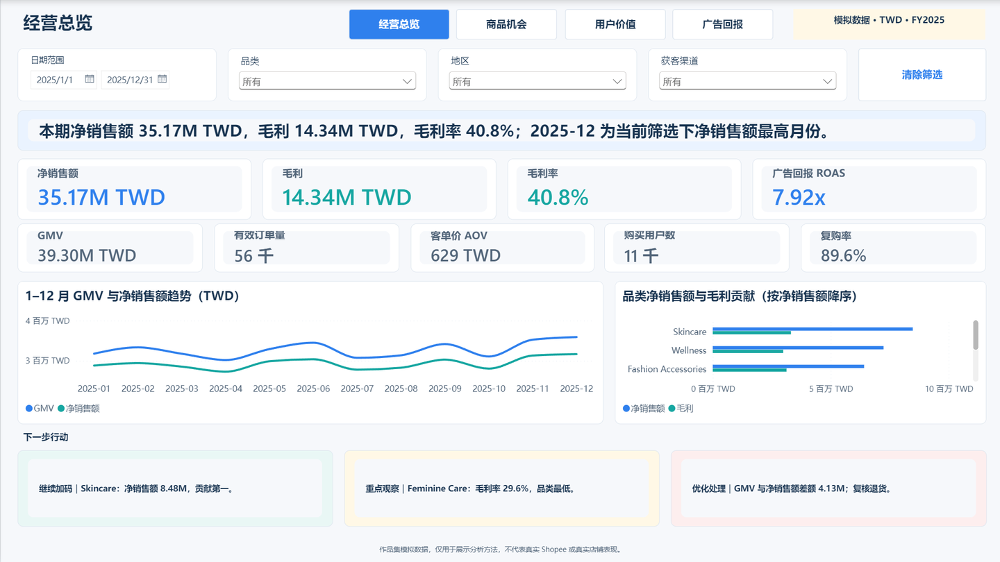
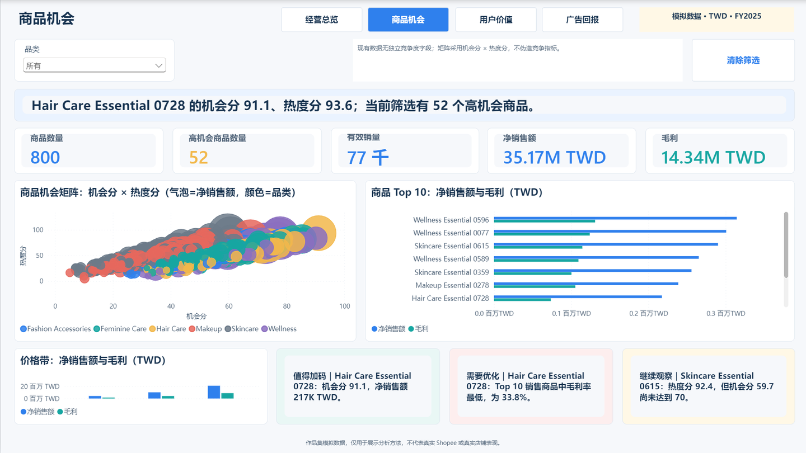
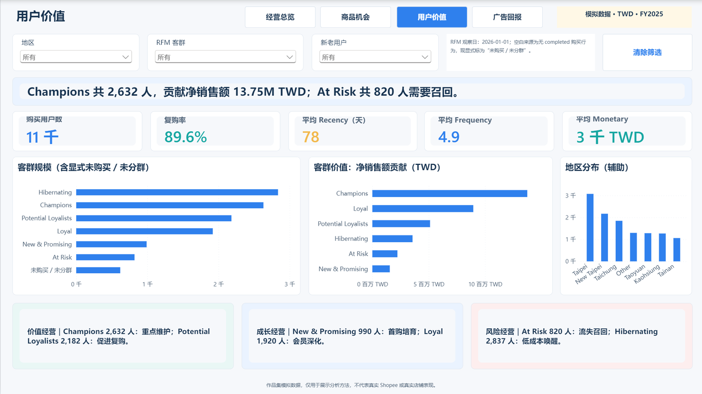
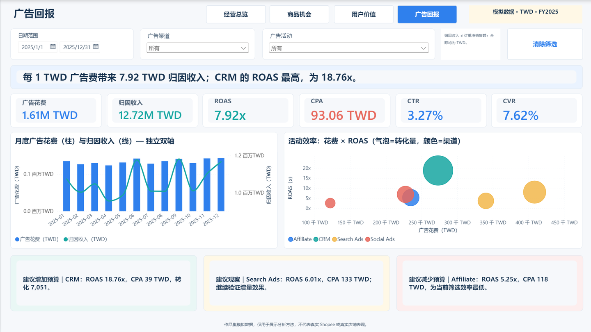

# Ecommerce Operations Analytics Assistant

> A reproducible, platform-neutral analytics portfolio for product, sales, customer and advertising decisions. The case models Taiwan women's consumer goods; **all distributed business data is synthetic and does not represent real Shopee performance**.



**V1.2 status:** the genuine four-page PBIP/PBIR/TMDL source was redesigned for executive storytelling and saved as a 3.17 MB PBIX with Power BI Desktop. The PBIX was closed, reopened in a new Desktop process, and all four pages were captured successfully through the Desktop bridge. The original V1.1 PBIX remains available unchanged.

中文完整项目说明：[`PROJECT_OVERVIEW_V1.2.md`](PROJECT_OVERVIEW_V1.2.md)

## What the project answers

- Which categories, products and price bands combine demand with attractive margin or lower modeled competition?
- How do GMV, net sales, completed orders, gross profit, AOV and repeat behavior change over time?
- Which RFM groups, regions and acquisition channels deserve retention or win-back actions?
- Which campaigns win on CTR, CVR, CPA and ROAS, and where should capped test budget move next?

## Stack and data flow

Python 3.12 · pandas · NumPy · MySQL 8 SQL · SQLite verification · Power BI Desktop · PBIP/PBIR/TMDL · DAX · HTML/CSS/JavaScript · unittest · Git

```text
compliant collector framework / fixed-seed generator
                  ↓
     products · users · orders · ads · calendar
                  ↓
 MySQL 8 implementation + SQLite executable verification
                  ↓
      Python/SQL/DAX metric reconciliation
                  ↓
 product · operations · RFM · advertising decisions
```

See the [architecture](docs/architecture.md), [data dictionary](docs/data_dictionary.md) and [metric dictionary](docs/metric_dictionary.md).

## Verified portfolio findings

All figures below describe the generated FY2025 dataset only:

- GMV is **TWD 39.30M**, completed net sales **TWD 35.17M**, gross profit **TWD 14.34M**, and gross margin **40.8%**. Promotion growth should be judged with profit and AOV, not volume alone.
- **55,890** completed orders came from **11,381** purchasing users; AOV is **TWD 629.26** and the fixed-window repeat rate is **89.6%**.
- Advertising delivered **3.27% CTR**, **7.62% CVR**, **TWD 93.06 CPA**, and **7.92× ROAS**. Attributed revenue is a channel attribution measure, not causal incrementality or order revenue.
- The top 20 products contribute **11.6%** of completed net sales, so the portfolio has a broad long tail. Protect availability for proven products while pruning on margin and strategic role.
- Hot Score and Opportunity Score create transparent shortlists; they do not substitute for real demand, landed-cost, return-risk or competitor validation.

The complete fact → hypothesis → action → validation record is in [reports/insights.md](reports/insights.md).

## Power BI deliverables

| Operations overview | Product analysis |
|---|---|
|  |  |
| Customer and RFM | Advertising analysis |
|  |  |

- [Download/open the validated V1.2 PBIX](dashboard/powerbi_project/Ecommerce-Operations-Analytics-Assistant-v1.2.pbix)
- [Keep/reference the original V1.1 PBIX](dashboard/powerbi_project/Ecommerce-Operations-Analytics-Assistant-v1.1.pbix)
- [Open the version-controlled PBIP](dashboard/powerbi_project/Ecommerce-Operations-Analytics-Assistant.pbip)
- [Review the Power BI build and refresh guide](dashboard/powerbi_build_guide.md)
- [Review the V1.2 design report](reports/powerbi_design_v1.2.md), [DAX measures](dashboard/dax_measures.md) and [validation record](reports/powerbi_validation.md)

The four report pages are **经营总览**, **商品机会**, **用户价值** and **广告回报**. Each follows conclusion → KPI → evidence → action, with synchronized date/category/region filters where applicable, native navigation and clear-filter controls. Every page carries a synthetic-data notice and uses TWD consistently.

The PBIX embeds the validated data and opens without rebuilding the pipeline. For PBIP source-control work, regenerate the ignored import CSVs, set the single `DataRoot` Power Query parameter to the absolute `dashboard/powerbi_data` folder on your machine, and refresh. This avoids committing an author-specific path.

The dependency-free [interactive HTML dashboard](dashboard/interactive_dashboard.html) remains available for reviewers without Power BI Desktop.

## Quick start

```powershell
python -m pip install -r requirements.txt
python run_pipeline.py
```

The pipeline regenerates deterministic data, builds the SQLite validation database, runs four analysis themes, exports HTML/PNG dashboard assets, reconciles SQL/Python metrics, and executes the test suite.

Run individual stages:

```powershell
python data/generate_data.py --products 800 --users 12000 --orders 60000
python analysis/run_analysis.py
python dashboard/build_dashboard.py
python -m unittest discover -s tests -v
```

For MySQL 8, follow [database/README.md](database/README.md). Credentials belong in environment variables based on [.env.example](.env.example); never commit `.env`.

## Repository structure

```text
crawler/      compliant public collector framework and access boundaries
database/     MySQL 8 schema, indexes, loader and business SQL analyses
data/         fixed-seed generator, tracked samples and local full outputs
analysis/     product, operations, RFM and advertising analysis
dashboard/    real PBIP/PBIX, DAX, screenshots and browser preview
reports/      KPI summary, validation records, insights and charts
tests/        data quality, reproducibility, metrics and PBIP/PBIR checks
docs/         architecture, dictionaries, runbook, limits and portfolio pitch
```

## Data provenance, compliance and limits

- `data/sample/*` and regenerated full datasets are **100% synthetic**, seed `20260801`; product URLs use `example.com` placeholders.
- No password, cookie, token, personal identity or sensitive customer data is included.
- The collector is disabled by default until a human reviews site terms and passes an acknowledgement flag. It checks robots rules, rate-limits requests, bounds retries and never bypasses access controls.
- This project cannot establish real Taiwan category demand, competitor behavior, customer economics or advertising incrementality. Scores and findings are relative to one simulated sample.
- MySQL 8 artifacts received static compatibility review, but the available local service could not be authenticated safely. SQLite execution and independent KPI reconciliation passed; this is not presented as a live MySQL import result.

## Reproducibility and quality

The default run creates 800 products, 12,000 users, 60,000 orders, 2,190 daily campaign rows and 365 dates. Tests cover scale, keys, missingness, ranges, order equations, foreign keys, dates/currency, Hot and Opportunity score recomputation, fixed-seed reproducibility, portable dashboard inputs, SQL/Python/DAX parity, and the four-page PBIR structure. Results are recorded in [reports/test_results.md](reports/test_results.md) and [reports/powerbi_validation.md](reports/powerbi_validation.md).

## Roadmap

- **V1.1 — preserved:** original genuine PBIP/PBIX baseline, four report pages and KPI reconciliation.
- **V1.2 — completed:** executive-storytelling redesign, dynamic conclusions/actions, RFM blank-segment fix, validated PBIX reopen and clean 1440×810 screenshots.
- **V1.5:** seller-authorized exports or a terms-approved public dataset; score-weight sensitivity tests; CI.
- **V2.0:** inventory and return modeling, causal promotion tests and forecast baselines.
- **V2.5:** user-authorized hosted demo and scheduled refresh.

## Portfolio use

The [portfolio pitch](docs/portfolio_pitch.md) contains a 60-second interview introduction and three resume-ready bullets. The repository is ready for local review; publishing or updating a remote is intentionally outside this V1.2 task.
