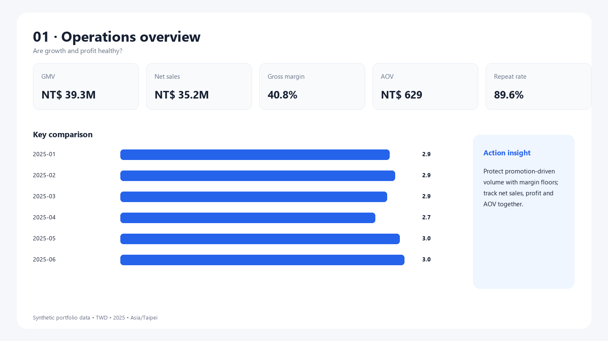
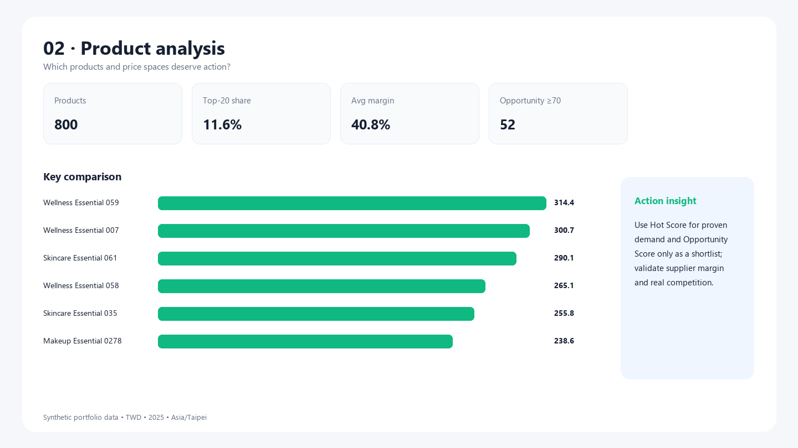
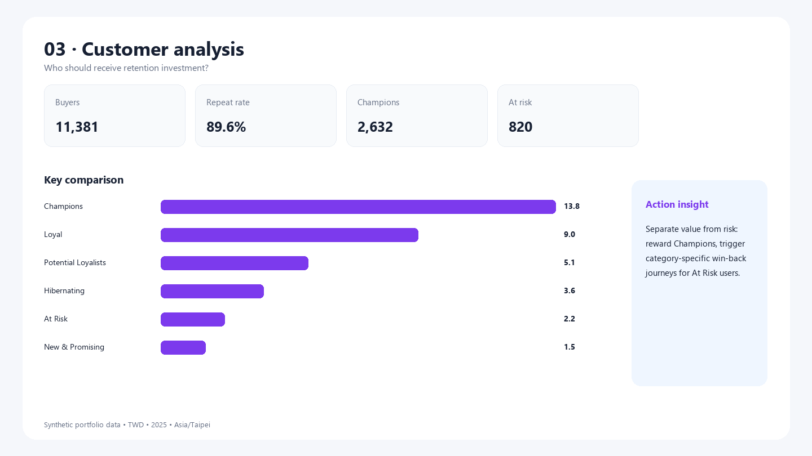
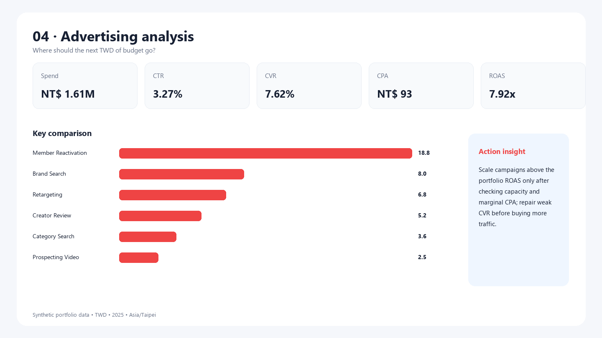

# Ecommerce Operations Analytics Assistant

> A reproducible, platform-neutral analytics portfolio that turns product, order, customer and advertising data into concrete e-commerce operating decisions. The business setting is Taiwan women's consumer goods; **all distributed data is synthetic and does not represent real Shopee performance**.



## What this project answers

- Which categories and price bands are crowded, and which products combine demand with lower modeled competition?
- Where do net sales and gross profit come from, and how do promotions change performance?
- Which customers are Champions, Loyal, At Risk or Hibernating, and what lifecycle action fits each group?
- Which campaigns win on CTR, CVR, CPA and ROAS, and where should test budget move next?

## Stack and data flow

Python 3.12 · pandas · NumPy · Pillow · MySQL 8 · SQLite validation · SQL CTEs/window functions · Power BI star model/DAX · HTML/CSS/JavaScript · unittest · Git

```text
compliant collector framework / fixed-seed generator
                  ↓
        five CSV data contracts
                  ↓
 MySQL 8 schema + SQLite fallback validation
                  ↓
       SQL and Python reconciliation
                  ↓
 four analysis themes → Dashboard → decisions
```

See the [architecture](docs/architecture.md), [data dictionary](docs/data_dictionary.md) and [metric dictionary](docs/metric_dictionary.md).

## Verified portfolio findings

These numbers describe the generated dataset only:

- GMV is **NT$39.3M**, completed net sales **NT$35.2M**, and gross margin **40.8%**. Track promotion volume with profit and AOV to avoid buying unprofitable growth.
- The annual repeat rate is **89.6%**, reflecting deliberately heterogeneous repeat propensity. Separate Champions rewards from At Risk win-back campaigns and validate 30/60-day retained margin.
- Portfolio ad performance is **3.27% CTR**, **7.62% CVR**, **NT$93 CPA** and **7.92× ROAS**. Reallocate only through capped marginal tests, because attributed revenue is not causal lift.
- The top 20 products contribute **11.6%** of completed net sales, leaving a broad long tail. Combine top-product availability protection with portfolio pruning based on margin and strategic role.
- Hot Score and Opportunity Score provide transparent shortlists, not automated launch decisions. Validate shortlisted items with real search demand, competitor density, landed margin and return risk.

Full fact → hypothesis → action → validation statements are in [reports/insights.md](reports/insights.md).

## Dashboard

| Operations | Products |
|---|---|
|  |  |
| Customers | Advertising |
|  |  |

Open [dashboard/interactive_dashboard.html](dashboard/interactive_dashboard.html) locally for a dependency-free four-page interactive preview. Category and advertising-channel filters update the relevant KPIs and rankings.

Power BI Desktop was not available in the inspected environment, so the repository deliberately contains **no fake PBIX**. It includes full generated import CSVs, a star model, core DAX, page specifications and a [short build guide](dashboard/powerbi_build_guide.md). The CSVs are generated locally and excluded from Git to avoid repository bloat.

## Quick start

The tested path uses the bundled/current Python environment with pandas, NumPy and Pillow:

```powershell
python -m pip install -r requirements.txt
python run_pipeline.py
```

If `python` is not on PATH, invoke the actual Python executable explicitly. The pipeline regenerates data, creates the SQLite validation database, calculates analyses, exports four dashboard images and HTML, reconciles SQL/Python metrics, and runs the test suite.

Run individual stages:

```powershell
python data/generate_data.py --products 800 --users 12000 --orders 60000
python analysis/run_analysis.py
python dashboard/build_dashboard.py
python -m unittest discover -s tests -v
```

For MySQL 8, follow [database/README.md](database/README.md). Credentials belong in environment variables based on `.env.example`; never commit `.env`.

## Repository structure

```text
crawler/      compliant public collector framework and boundaries
database/     MySQL schema, indexes, loader and 10 business SQL analyses
data/         fixed-seed generator, tracked samples and local full outputs
analysis/     four-domain analysis, SQLite validation and visual export
dashboard/    DAX, star model guide, full import data and interactive preview
reports/      KPI summary, analysis tables, insights and four page previews
tests/        uniqueness, completeness, ranges, FK and metric reconciliation
docs/         architecture, dictionaries, runbook, limitations and portfolio pitch
```

## Data provenance, compliance and limits

- `data/sample/*` and regenerated full datasets are **100% synthetic**, seed `20260801`. Product URLs use `example.com` placeholders.
- No password, Cookie, token, user identity or sensitive personal data is included. User IDs and attributes are generated.
- The collector is disabled-by-intent until a human reviews site terms and passes an acknowledgement flag. It checks robots, rate-limits, bounds retries and never bypasses access controls.
- This project cannot establish real Taiwan category demand, competitor behavior, customer economics or advertising incrementality. Scores and findings are relative to one simulated sample.
- MySQL 8 files are complete, but actual schema import could not be authenticated because the local service requires an unknown root password. Credential-free SQLite validation was executed instead.

## Reproducibility and quality

The generator produces 800 products, 12,000 users, 60,000 orders, 2,190 daily campaign rows and 365 calendar rows. Tests cover key uniqueness, missingness, valid ranges, amount equations, foreign keys and SQL/Python/Dashboard metric parity. Results are recorded in [reports/test_results.md](reports/test_results.md).

## Roadmap

- **V1.1:** use seller-authorized exports or a terms-approved public dataset; add sensitivity tests for score weights.
- **V1.5:** incremental loads, data versioning, scheduled quality reports and CI.
- **V2.0:** inventory and returns modeling, causal promotion tests and forecast baselines with error metrics.
- **V2.5:** publish a user-authorized Streamlit demo and a verified PBIX.

## Portfolio use

The [portfolio pitch](docs/portfolio_pitch.md) contains a 60-second interview introduction and three resume-ready bullets. This repository is prepared for local review only; no remote repository has been created or pushed.

