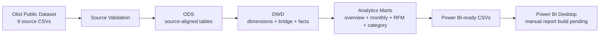
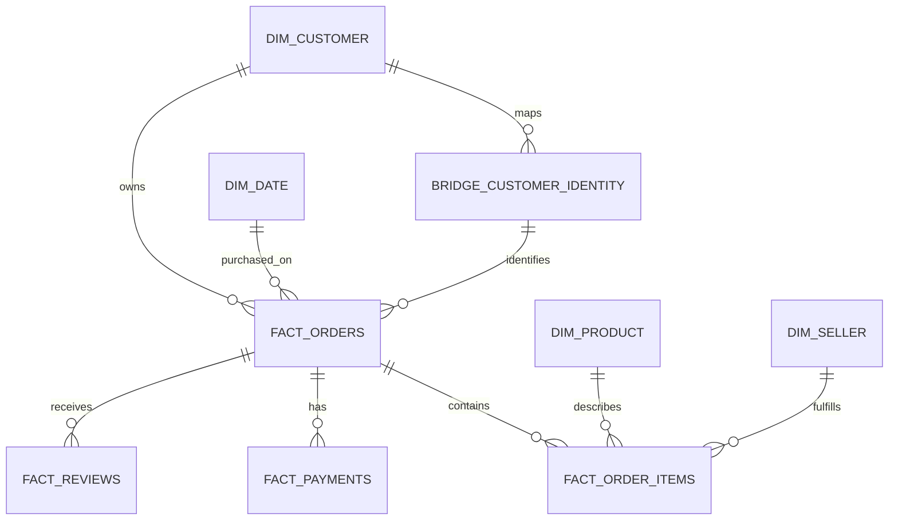

# Ecommerce Operations Analytics

An end-to-end analytics portfolio project built on the public Brazilian ecommerce dataset from Olist. It turns nine source CSV files into a validated ODS layer, a grain-safe dimensional model, business analytics marts, and Power BI-ready exports.

The project focuses on customer identity resolution, multi-fact modeling, auditable KPI definitions, RFM analysis, category performance, and automated reconciliation. Synthetic V1.1 remains in the repository as a legacy prototype; the primary project narrative and current development path use real Olist data.

[Data setup](data/README.md) · [Analytics definitions](docs/olist_analytics_layer.md) · [Business insights](docs/olist_business_insights.md) · [Power BI specification](docs/olist_powerbi_dashboard_spec.md)

## Dashboard Preview

**Current status:** the Olist ODS, DWD, Analytics marts, and six Power BI-ready CSV exports are implemented. The two-page Olist PBIX has not yet been created in Power BI Desktop, so this README does not show placeholder or Synthetic screenshots as if they were Olist results.

The required pages, visuals, acceptance criteria, and manual build steps are defined in the [Olist Power BI Dashboard Specification](docs/olist_powerbi_dashboard_spec.md). Final screenshots will be added only after the PBIX is refreshed, reconciled, saved, and reopened.

## Project Overview

The source dataset stores orders, items, payments, and reviews at different grains. A direct wide join would multiply rows and overstate GMV or payment value. Customer records also use two identifiers: `customer_id` identifies an order-specific customer record, while `customer_unique_id` identifies the same person across records.

This project solves those modeling problems before calculating business metrics:

- validates all nine source files before loading;
- preserves source-aligned ODS tables and lineage fields;
- separates order, item, payment, and review facts;
- resolves customer identity through a dedicated bridge;
- aggregates each fact independently before combining business metrics;
- publishes small, documented marts for Power BI;
- reconciles overview, monthly, customer, segment, and category results to DWD facts.

## Business Questions

The analytics layer answers three groups of questions:

1. **Overall performance:** How many delivered orders and purchasing customers are present? What are Merchandise GMV, Paid Value, AOV, review score, and cancellation rate?
2. **Customer behavior:** How many canonical customers purchase repeatedly? What are their Recency, Frequency, Monetary value, and RFM segments?
3. **Product and category performance:** Which categories generate merchandise value? Which combine material order volume with higher freight burden or lower ratings?

## Architecture


```mermaid
flowchart LR
    A[Olist Public Dataset<br/>9 source CSVs] --> B[Source Validation]
    B --> C[ODS<br/>source-aligned tables]
    C --> D[DWD<br/>dimensions + bridge + facts]
    D --> E[Analytics Marts<br/>overview + monthly + RFM + category]
    E --> F[Power BI-ready CSVs]
    F --> G[Power BI Desktop<br/>manual report build pending]
```

The Olist pipeline is isolated in `etl/olist/` and writes to `data/olist_analytics.sqlite`. It does not overwrite the legacy Synthetic database at `data/analytics.sqlite`.

## Dataset

The project uses the [Brazilian E-Commerce Public Dataset by Olist](https://www.kaggle.com/datasets/olistbr/brazilian-ecommerce). It is public historical marketplace data, not internal company data.

| Source | Rows | Grain |
|---|---:|---|
| Customers | 99,441 | One customer record |
| Orders | 99,441 | One order |
| Order items | 112,650 | One order item |
| Payments | 103,886 | One payment record |
| Reviews | 99,224 | One review record |
| Products | 32,951 | One product |
| Sellers | 3,095 | One seller |
| Geolocation | 1,000,163 | One geographic observation |
| Category translation | 71 | One Portuguese category mapping |

Order purchase timestamps range from **2016-09-04 21:15:19** to **2018-10-17 17:30:18**. The current delivered-sales scope ends on 2018-08-29, producing a deterministic RFM as-of date of 2018-08-30. Monetary values are BRL.

Raw data is downloaded by the user and excluded from Git. See [data/README.md](data/README.md) for the expected files and rebuild commands.

## Data Model


```mermaid
erDiagram
    DIM_CUSTOMER ||--o{ BRIDGE_CUSTOMER_IDENTITY : maps
    BRIDGE_CUSTOMER_IDENTITY ||--o{ FACT_ORDERS : identifies
    DIM_CUSTOMER ||--o{ FACT_ORDERS : owns
    DIM_DATE ||--o{ FACT_ORDERS : purchased_on
    FACT_ORDERS ||--o{ FACT_ORDER_ITEMS : contains
    FACT_ORDERS ||--o{ FACT_PAYMENTS : has
    FACT_ORDERS ||--o{ FACT_REVIEWS : receives
    DIM_PRODUCT ||--o{ FACT_ORDER_ITEMS : describes
    DIM_SELLER ||--o{ FACT_ORDER_ITEMS : fulfills
```

The DWD layer contains four dimensions, one customer identity bridge, and four independent facts:

| Table | Grain |
|---|---|
| `dim_customer` | One `customer_unique_id` |
| `dim_product` | One `product_id` |
| `dim_seller` | One `seller_id` |
| `dim_date` | One calendar date |
| `bridge_customer_identity` | One `customer_id` mapping |
| `fact_orders` | One order |
| `fact_order_items` | One `(order_id, order_item_id)` |
| `fact_payments` | One `(order_id, payment_sequential)` |
| `fact_reviews` | One source review record |

The Analytics layer intentionally stays small:

| Mart | Grain |
|---|---|
| `mart_business_overview` | One all-time snapshot |
| `mart_monthly_performance` | One purchase month |
| `mart_customer_rfm` | One purchasing `customer_unique_id` |
| `mart_customer_segments` | One RFM segment |
| `mart_category_performance` | One source category |
| `analytics_metric_definitions` | One metric definition |

## Key Metrics

Current all-time values use delivered orders for sales and customer metrics:

| Metric | Definition | Result |
|---|---|---:|
| Orders | Distinct delivered orders | 96,478 |
| Purchasing Customers | Distinct delivered-order `customer_unique_id` | 93,358 |
| Merchandise GMV | Delivered item `price_brl` | BRL 13,221,498.11 |
| Paid Value | Delivered payment `payment_value_brl` | BRL 15,422,461.77 |
| Units Sold | Delivered order-item records | 110,197 |
| AOV | Merchandise GMV / delivered orders | BRL 137.04 |
| Repeat Purchase Rate | Customers with at least two delivered orders / purchasing customers | 3.00% |
| Average Review Score | Review records attached to delivered orders | 4.156 |
| Cancel Rate | Canceled orders / all placed orders | 0.629% |

Merchandise GMV and Paid Value remain separate. Freight is excluded from Merchandise GMV. Metric formulas, sources, scopes, and RFM rules are documented in [docs/olist_analytics_layer.md](docs/olist_analytics_layer.md) and stored in `analytics_metric_definitions`.

## Customer Identity Resolution

`customer_id` is an order-level customer record and cannot represent a stable person. The pipeline keeps all 99,441 customer records in `bridge_customer_identity` and maps them to 96,096 canonical `customer_unique_id` values.

Purchasing Customers, Repeat Customers, Repeat Purchase Rate, Orders per Customer, and RFM all use `customer_unique_id`. The current delivered-order mart contains 93,358 purchasing customers and exactly one RFM row per customer.

## Data Quality and Testing

Quality gates cover:

- source file presence, columns, hashes, timestamps, key uniqueness, and relationships;
- ODS row-count preservation and technical lineage;
- DWD table existence, primary keys, foreign keys, fact grains, status preservation, BRL contracts, and GMV join safety;
- Analytics table grains, canonical customer identity, RFM scores, valid metric ranges, and metric definitions;
- independent reconciliation of Merchandise GMV and Paid Value;
- monthly, category, and customer-segment reconciliation;
- stable Power BI CSV export row counts;
- regression checks for the legacy Synthetic and Power BI artifacts.

Run all tests with:

```powershell
.\.venv\Scripts\python.exe -m unittest discover -s tests -v
```

## Power BI Dashboard

`etl.olist.build_analytics` writes six stable UTF-8 CSV files to `dashboard/powerbi_data/`. They are generated artifacts and are excluded from Git.

The planned Olist report contains two pages:

1. **Executive Overview:** Merchandise GMV, Orders, Purchasing Customers, AOV, Repeat Purchase Rate, Average Review Score, monthly trends, categories, and source order status.
2. **Customer & Product Insights:** RFM segments, repeat versus one-time customers, customer monetary distribution, category GMV, reviews, freight ratio, and risk categories.

The Olist PBIX still requires manual Power BI Desktop work. The repository does not claim that these pages or their screenshots already exist.

## Key Insights

- Only **3.00%** of purchasing customers have at least two delivered orders; 97.00% have exactly one.
- `health_beauty` is the largest category with BRL 1.23 million in delivered Merchandise GMV, or 9.33% of the total.
- Among categories with at least 1,000 delivered orders, `office_furniture` has the highest low-rating rate at 22.02%, alongside a 25.01% freight ratio.
- November 2017 is the highest delivered-GMV month at BRL 987,765.37.
- Paid Value exceeds Merchandise GMV because they represent different facts; aggregate freight explains nearly all of the difference.

See [docs/olist_business_insights.md](docs/olist_business_insights.md) for evidence, interpretation limits, and possible actions.

## Tech Stack

| Area | Technologies |
|---|---|
| Data engineering | Python 3.12, pandas, SQLite |
| Modeling | ODS, dimensional modeling, fact grains, identity bridge |
| Analytics | SQL window functions, deterministic RFM, reconciled marts |
| Quality | `unittest`, transactional builds, source hashing, business reconciliation |
| BI delivery | Power BI-ready CSV, Power BI Desktop specification |
| Version control | Git and GitHub |

## Project Structure

```text
etl/olist/
  validator.py              Source contracts and validation
  load_ods.py               Transactional ODS loader
  dwd_schema.py             DWD table contracts
  build_dwd.py              ODS-to-DWD transformations
  dwd_quality.py            DWD grain and integrity checks
  analytics_schema.py       Analytics mart contracts
  build_analytics.py        DWD-to-Analytics build and CSV export
  analytics_quality.py      Business metric reconciliation

tests/                       Source, ODS, DWD, Analytics, and regression tests
docs/                        Technical design, metrics, insights, and BI spec
data/raw/olist/              User-downloaded source CSVs, Git-ignored
data/olist_analytics.sqlite  Generated Olist database, Git-ignored
dashboard/powerbi_data/      Generated Power BI inputs, Git-ignored
```

Legacy Synthetic code remains under `data/generate_data.py`, `analysis/`, `database/`, and the existing `dashboard/powerbi_project/`.

## How to Reproduce

### 1. Create the environment

```powershell
py -3.12 -m venv .venv
.\.venv\Scripts\python.exe -m pip install -r requirements.txt
```

### 2. Download the Olist dataset

Authenticate the official Kaggle CLI and download `olistbr/brazilian-ecommerce` into `data/raw/olist/`. Exact commands and the expected nine files are listed in [data/README.md](data/README.md).

### 3. Build ODS, DWD, and Analytics

```powershell
.\.venv\Scripts\python.exe -m etl.olist.load_ods
.\.venv\Scripts\python.exe -m etl.olist.build_dwd
.\.venv\Scripts\python.exe -m etl.olist.build_analytics
```

### 4. Run validation

```powershell
.\.venv\Scripts\python.exe -m unittest discover -s tests -v
```

### 5. Build the Olist Power BI report

Open Power BI Desktop and follow [docs/olist_powerbi_dashboard_spec.md](docs/olist_powerbi_dashboard_spec.md). This step is manual and is not performed by the Python pipeline.

## Limitations

- Olist is public historical data and is not a live enterprise system.
- The first and last purchase months are partial and should not be used for naive period-over-period comparisons.
- The dataset does not provide reliable product cost, gross profit, gross margin, advertising exposure, clicks, spend, or attribution.
- `delivered` is a documented analytics filter, not a renamed source status.
- Reviews are order-level; category attribution cannot establish item-level causes.
- RFM segments are deterministic descriptive rules, not predictions.
- The Olist Power BI PBIX and screenshots require manual completion.

## Legacy Synthetic Prototype

The repository retains the earlier Synthetic V1.1/V1.2 prototype for engineering history and regression coverage. It includes fixed-seed users, orders, ads, TWD metrics, and validated four-page Power BI artifacts. Those files are not used as evidence for the Olist real-data metrics and are no longer the main project narrative.

## License

Project source code is available under the [MIT License](LICENSE). The Olist dataset remains subject to the terms shown on its Kaggle dataset page and is not redistributed as part of this repository.
