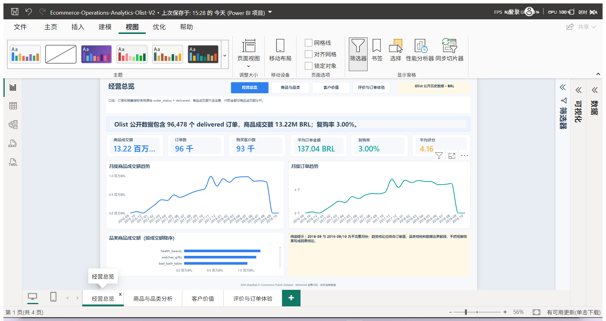
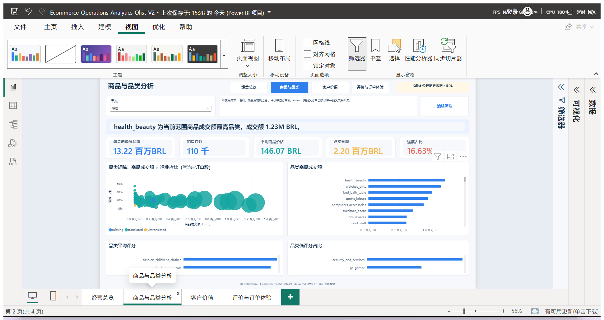
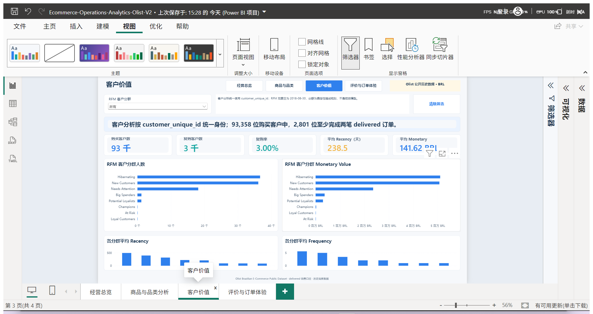
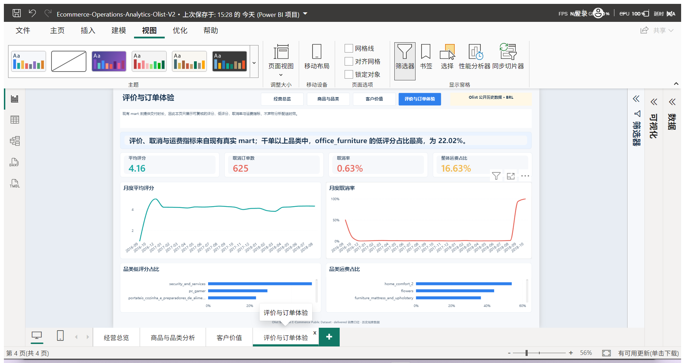
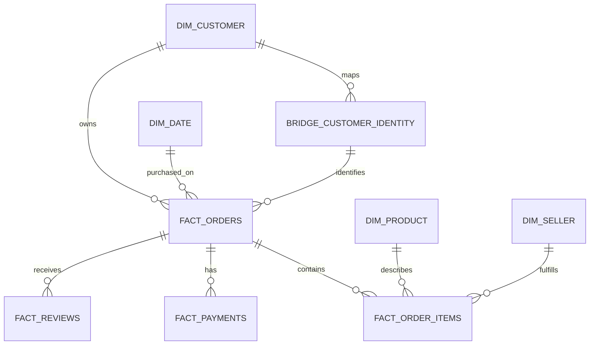

# 电商运营数据分析

这是一个基于 Olist Brazilian E-Commerce Public Dataset 的电商数据分析项目，覆盖数据清洗、ODS/DWD 分层建模、客户身份统一、Analytics 指标计算、RFM 客户分析和 Power BI 可视化。早期 Synthetic V1.1/V1.2 仍保留在仓库中作为历史原型，但不用于证明 Olist 指标。

> 数据边界：Olist 是公开历史数据，不是实时业务系统或企业内部数据。所有金额为 BRL；销售与客户指标采用原始 `order_status = 'delivered'` 口径。

[数据准备](data/README.md) · [指标与 mart](docs/olist_analytics_layer.md) · [业务洞察](docs/olist_business_insights.md) · [Power BI 说明](docs/olist_powerbi_dashboard_spec.md) · [验证记录](reports/olist_powerbi_validation.md)

## 当前状态

| 模块 | 状态 |
|---|---|
| Olist 原始数据校验 | 已完成 |
| Raw → ODS | 已完成 |
| ODS → DWD | 已完成 |
| Customer identity bridge | 已完成 |
| Analytics marts 与 6 个 Power BI CSV | 已完成 |
| RFM、复购与品类分析 | 已完成 |
| Power BI PBIP/PBIR/TMDL | 已完成 |
| Power BI PBIX | 已在 Power BI Desktop 中刷新、保存并重新打开验证 |
| Synthetic V1.1/V1.2 | 保留为 Legacy，不与 Olist 混用 |

## Dashboard 预览

### 1. 经营总览



### 2. 商品与品类分析



### 3. 客户价值



### 4. 评价与订单体验



第四页仅使用现有 mart 能支持的评分、低评分、取消率与运费指标。当前数据层没有交付时长 mart，因此报表不声称分析配送时效。

## 业务问题

项目主要回答三类问题：

1. 经营表现：delivered 订单、购买客户、Merchandise GMV、Paid Value、AOV、评分和取消率如何变化？
2. 客户价值：按 `customer_unique_id` 统一身份后，复购客户有多少，RFM 分群结构如何？
3. 商品与体验：哪些品类贡献成交额，哪些品类同时出现较高运费占比或较低评分？

## 数据架构


```mermaid
flowchart LR
    A[Olist Public Dataset<br/>9 CSV] --> B[Source Validation]
    B --> C[ODS<br/>source-aligned]
    C --> D[DWD<br/>dimensions + bridge + facts]
    D --> E[Analytics Marts<br/>overview + monthly + RFM + category]
    E --> F[6 Power BI CSV exports]
    F --> G[Power BI<br/>PBIP + PBIX + screenshots]
```

Olist 管道位于 `etl/olist/`，输出 `data/olist_analytics.sqlite`。它不会覆盖 Synthetic 使用的 `data/analytics.sqlite`。

## 数据模型


```mermaid
erDiagram
    DIM_CUSTOMER ||--o{ BRIDGE_CUSTOMER_IDENTITY : maps
    BRIDGE_CUSTOMER_IDENTITY ||--o{ FACT_ORDERS : identifies
    DIM_CUSTOMER ||--o{ FACT_ORDERS : owns
    DIM_DATE ||--o{ FACT_ORDERS : purchased_on
    FACT_ORDERS ||--o{ FACT_ORDER_ITEMS : contains
    FACT_ORDERS ||--o{ FACT_PAYMENTS : has
    FACT_ORDERS ||--o{ FACT_REVIEWS : receives
    DIM_PRODUCT ||--o{ FACT_ORDER_ITEMS : describes
    DIM_SELLER ||--o{ FACT_ORDER_ITEMS : fulfills
```

关键设计是将订单、商品、支付和评价保留为独立事实表，并在合并前按 `order_id` 分别聚合，避免一对多 join 放大金额。`customer_id` 是订单级客户记录，稳定客户身份使用 `customer_unique_id`，二者通过 `bridge_customer_identity` 映射。

## Analytics marts

| Mart | 粒度 | 当前行数 |
|---|---|---:|
| `mart_business_overview` | 全周期快照 | 1 |
| `mart_monthly_performance` | 购买月份 | 25 |
| `mart_customer_rfm` | 购买客户 `customer_unique_id` | 93,358 |
| `mart_customer_segments` | RFM 分群 | 8 |
| `mart_category_performance` | 来源品类 | 74 |
| `analytics_metric_definitions` | 指标定义 | 16 |

## 核心指标

| 指标 | 定义 | 结果 |
|---|---|---:|
| Orders | delivered distinct `order_id` | 96,478 |
| Purchasing Customers | delivered distinct `customer_unique_id` | 93,358 |
| Merchandise GMV | delivered item `price_brl` | BRL 13,221,498.11 |
| Paid Value | delivered payment `payment_value_brl` | BRL 15,422,461.77 |
| Units Sold | delivered order-item records | 110,197 |
| AOV | Merchandise GMV / Orders | BRL 137.04 |
| Repeat Purchase Rate | 至少 2 单客户 / 购买客户 | 3.00% |
| Average Review Score | delivered 订单关联评价 | 4.156 |
| Cancel Rate | canceled 订单 / 全部下单 | 0.629% |

Merchandise GMV 不含运费，不能与 Paid Value 混称。Olist 数据不提供可靠的商品成本、广告曝光/点击/花费或确认退款结果，因此主版本不计算 ROAS、CTR、CVR、CPA、Gross Profit 或 Gross Margin。

## 主要发现

- 93,358 位购买客户中有 2,801 位至少完成两笔 delivered 订单，复购率为 3.00%。
- `health_beauty` 的 delivered Merchandise GMV 为 BRL 1.23M，是当前最高品类。
- 在至少 1,000 单的品类中，`office_furniture` 的低评分占比最高，为 22.02%；该关联不能证明运费或配送导致评分。
- 2017-11 是 delivered Merchandise GMV 最高月份，金额为 BRL 987,765.37。

详细证据与解释边界见 [Olist 业务洞察](docs/olist_business_insights.md)。

## 复现步骤

### 1. 创建环境

```powershell
py -3.12 -m venv .venv
.\.venv\Scripts\python.exe -m pip install -r requirements.txt
```

### 2. 下载数据

按 [data/README.md](data/README.md) 将 Kaggle 数据集 `olistbr/brazilian-ecommerce` 的 9 个 CSV 放入 `data/raw/olist/`。原始数据、SQLite 和导出 CSV 均由 `.gitignore` 排除。

### 3. 构建数据层

```powershell
.\.venv\Scripts\python.exe -m etl.olist.load_ods
.\.venv\Scripts\python.exe -m etl.olist.build_dwd
.\.venv\Scripts\python.exe -m etl.olist.build_analytics
```

### 4. 运行测试

```powershell
.\.venv\Scripts\python.exe -m unittest discover -s tests -v
```

### 5. 打开 Power BI

- 直接查看：`dashboard/powerbi_project/Ecommerce-Operations-Analytics-Olist-V2.pbix`
- 源码模式：打开同目录的 `Ecommerce-Operations-Analytics-Olist-V2.pbip`，将参数 `DataRoot` 设置为本机 `dashboard/powerbi_data` 的绝对路径后刷新。

PBIP 使用独立的 Olist `.Report` 与 `.SemanticModel` 目录，不会覆盖 Legacy Synthetic 项目。详细步骤见 [Power BI 构建与刷新](dashboard/powerbi_build_guide.md)。

## 项目结构

```text
etl/olist/                    Olist 校验、ODS、DWD、Analytics
tests/                        数据质量与回归测试
data/raw/olist/               用户下载的 9 个源 CSV（忽略）
data/olist_analytics.sqlite   生成数据库（忽略）
dashboard/powerbi_data/       6 个生成 CSV（忽略）
dashboard/powerbi_project/    Olist 与 Legacy Power BI 资产
docs/                         设计、指标、洞察和使用说明
reports/                      验证记录
```

## 限制

- 时间范围为历史快照，首尾月份不完整，不适合直接做朴素同比/环比结论。
- 评价是订单级数据，品类归因不能确认具体商品或物流事件是评分原因。
- RFM 是确定性描述规则，不是预测模型。
- 地理数据含重复邮编前缀，必须先定义确定性聚合规则才能进入报表。

完整边界见 [docs/limitations.md](docs/limitations.md)。

## Legacy Synthetic

Synthetic V1.1/V1.2 的固定种子用户、订单、广告、成本、TWD 指标以及四页 Power BI 资产继续保留，用于展示早期工程演进和回归检查。Legacy 中的广告、利润与评分模型不属于 Olist 主版本。

## License

代码采用 [MIT License](LICENSE)。Olist 数据集遵循其 Kaggle 页面所示条款，仓库不重新分发原始数据。
