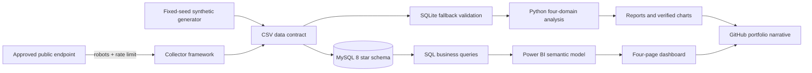

# Architecture

The source adapter and field mapping are replaceable. Product, user and calendar dimensions surround order and advertising facts, so the same metric layer can support another marketplace or a first-party store export.

