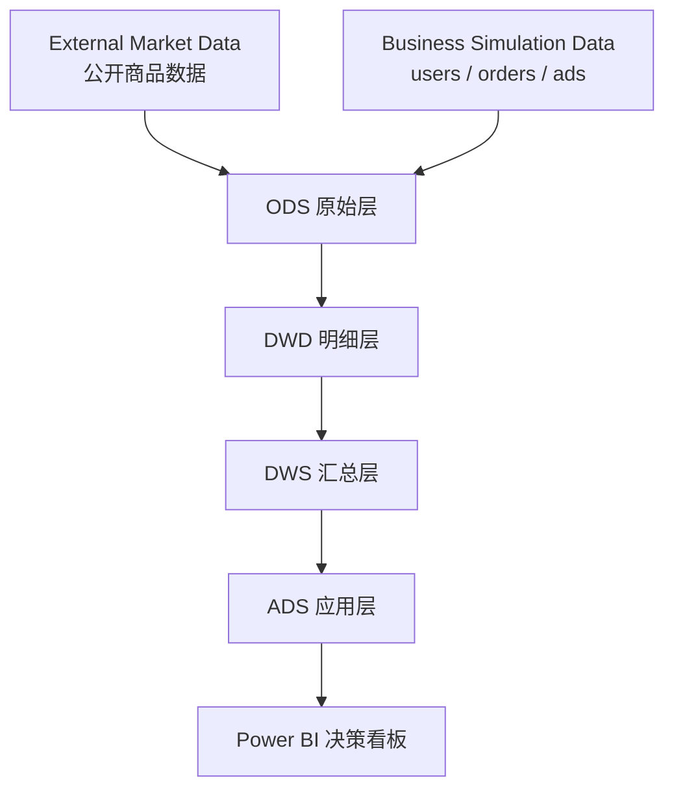

# 企业数据平台架构

Ecommerce Operations Analytics Assistant 使用轻量、可复现的数据工程架构，将外部市场数据与内部业务模拟数据经过 ODS、DWD、DWS、ADS 分层后交付给 Power BI。该分层描述的是仓库当前实现对应的企业数据职责，不代表已经部署了独立的大数据集群或分布式数仓。

## 总体架构



```text
External Market Data + Business Simulation Data
                     ↓
                ODS 原始层
                     ↓
                DWD 明细层
                     ↓
                DWS 汇总层
                     ↓
                ADS 应用层
                     ↓
              Power BI 决策看板
```

## 1. 数据源层

### External Market Data

External Market Data 提供公开商品市场属性，包括商品标识、商品名称、来源品类、价格、评分和评价数。数据优先来自许可证允许当前用途的公开数据集，或无需登录且允许访问的公开文件与接口。

职责：

- 提供真实公开商品属性；
- 保留来源、许可证、币种和采集时间等治理信息；
- 不采集登录后内容、客户隐私或受限交易数据；
- 不使用验证码破解、代理轮换或反爬绕过。

当前实现：`crawler/product_crawler.py` 和 `crawler/raw_data/raw_products.csv`。

### Business Simulation Data

Business Simulation Data 使用固定随机种子和业务规则生成用户、订单和广告数据，以替代不能公开分发的企业敏感数据。

职责：

- 生成可复现的 `users`、`orders` 和 `ads` 数据；
- 保留订单状态、金额等式、日期范围和主外键关系；
- 支持完整指标链路与数据质量测试；
- 明确模拟数据不代表真实企业经营表现。

当前实现：`data/generate_data.py` 中的用户、订单和广告生成函数。

## 2. ODS 原始层

ODS（Operational Data Store）负责接收和保留接近来源形态的数据，是数据进入平台后的第一落点。

主要职责：

- 保存外部商品数据的统一六字段输入合同；
- 尽量保留来源商品标识、名称和来源品类；
- 进行最基础的文件、表头和可读取性检查；
- 为后续清洗提供可追溯输入，不直接承担业务指标计算。

当前映射：

- `crawler/raw_data/raw_products.csv`：外部商品 ODS。
- 固定种子、业务规则和生成清单：内部模拟数据的可复现来源描述。

当前仓库中的 ODS 商品文件只提交表头模板。只有填入合法且通过校验的公开商品数据后，外部商品输入才会启用。

## 3. DWD 明细层

DWD（Data Warehouse Detail）负责形成粒度明确、字段标准、关系完整的业务明细数据。

主要职责：

- 统一字段名称、数据类型、币种和日期格式；
- 校验必填字段、主键、数值范围和业务品类映射；
- 建立商品、用户、订单、广告与日期之间的关联；
- 保留可用于明细追溯的业务粒度；
- 为 SQL、Python 和 Power BI 提供统一输入。

当前映射：

| DWD 数据集 | 业务粒度 | 路径 |
|---|---|---|
| 商品明细 | 每个商品一行 | `data/processed/products.csv` |
| 用户明细 | 每个用户一行 | `data/processed/users.csv` |
| 订单明细 | 每个订单一行 | `data/processed/orders.csv` |
| 广告明细 | 每日、每活动一行 | `data/processed/ads.csv` |
| 日期明细 | 每个自然日一行 | `data/processed/calendar.csv` |

## 4. DWS 汇总层

DWS（Data Warehouse Summary）围绕业务主题聚合 DWD 明细，为高频分析问题提供稳定、复用的汇总结果。

主要职责：

- 按月份汇总净销售额、订单、客户、成本、毛利和 AOV；
- 按商品与品类汇总销量、净销售额和毛利贡献；
- 汇总客户 RFM 价值与客群规模；
- 按渠道和活动汇总曝光、点击、花费、转化及归因收入；
- 为指标对账和应用层输出提供主题数据。

当前实现：

- `analysis/run_analysis.py` 中的 `monthly`、`products`、`categories`、`rfm` 和 `ads` 主题结果；
- SQLite 中的明细表与聚合查询；
- `database/analysis_queries.sql` 中的 MySQL 业务分析 SQL。

当前 DWS 是由 pandas 与 SQL 在 pipeline 中生成的轻量逻辑汇总层，并未伪装成独立部署的企业数仓服务。

## 5. ADS 应用层

ADS（Application Data Service）面向具体分析产品和业务使用场景组织数据。

主要职责：

- 输出经营、商品、客户和广告主题分析文件；
- 提供管理层 KPI、业务结论和决策建议所需数据；
- 向 Power BI 和浏览器 Dashboard 提供稳定输入；
- 保存 Python/SQL 指标对账结果及验证记录。

当前映射：

- `reports/*_analysis.csv`：主题分析结果；
- `reports/kpi_summary.json`：核心 KPI 应用输出；
- `dashboard/powerbi_data/*.csv`：Power BI 数据输入；
- `dashboard/interactive_dashboard.html`：轻量浏览器应用。

## 6. Power BI 展示层

Power BI 使用 ADS 数据和语义模型提供经营总览、商品机会、用户价值和广告回报四个决策页面。

主要职责：

- 使用 DAX 统一展示 KPI；
- 支持日期、品类、地区和渠道筛选；
- 将业务结论、原因证据和行动建议组织成管理层叙事；
- 通过 PBIP、PBIR 和 TMDL 支持版本管理与结构验证。

## 分层质量门禁

| 层级 | 关键检查 |
|---|---|
| 数据源 | 许可证、访问边界、来源字段、币种 |
| ODS | 文件可读、表头完整、输入非空或允许回退 |
| DWD | 空值、重复主键、类型、范围、业务等式、主外键 |
| DWS | 聚合粒度、分子分母、筛选条件、Python/SQL 一致性 |
| ADS | 输出完整、指标口径、文件路径、Dashboard 输入兼容性 |
| Power BI | DAX 口径、页面结构、数据刷新、KPI 对账与视觉验证 |

详细检查见 [data_quality.md](data_quality.md)，执行过程见 [etl_pipeline.md](etl_pipeline.md)。
