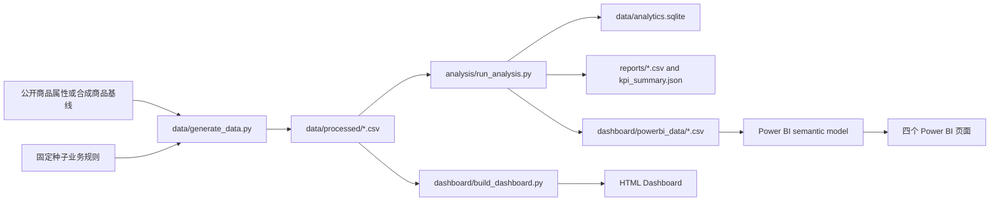
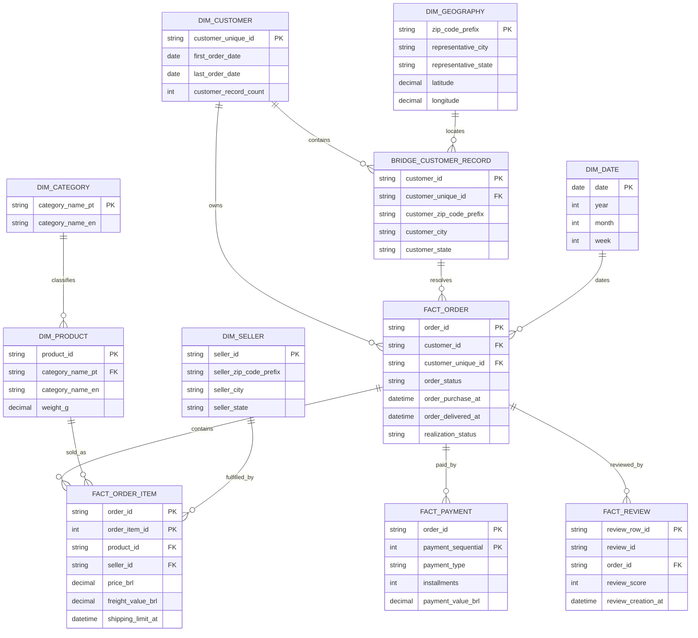
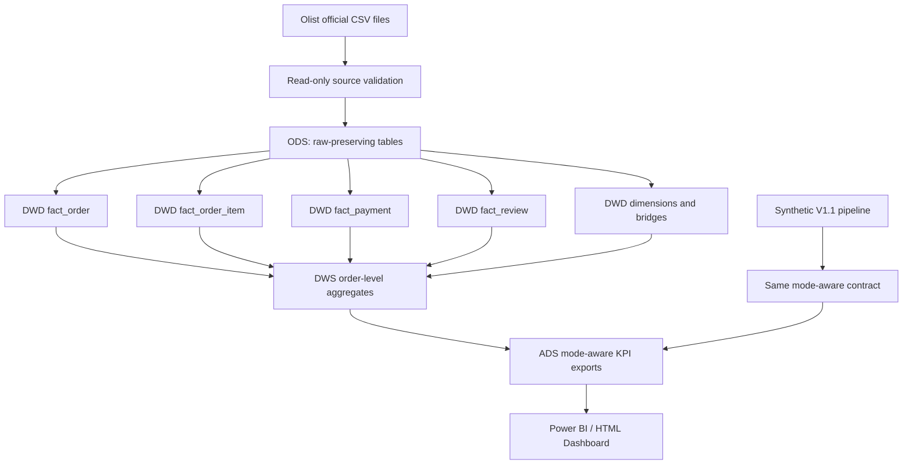

# Olist V2.0 数据模型映射与迁移架构设计

> 文档状态：设计评审稿  
> 适用范围：Ecommerce Operations Analytics Assistant V2.0 第一阶段之后的模型映射与迁移设计  
> 当前阶段：只做分析和设计，不实施 ETL、不改现有业务代码、不改数据库、不改 Power BI/DAX、不改测试、不提交 Git

本文把已经下载并审查过的 Olist Brazilian E-Commerce Public Dataset 映射到当前 V1.1 分析平台，明确哪些指标可以复用、哪些指标只能改名或改口径、哪些指标在 Olist 模式下必须不可用。它是下一阶段实现前的设计基线，不能被理解为已经完成 Olist 接入。

## 1. 执行摘要

当前 V1.1 是一个以固定种子模拟业务数据为核心的端到端分析原型：

- data/generate_data.py 生成 products、users、orders、ads、calendar 五张 CSV。
- analysis/run_analysis.py 读取这五张 CSV，写入 SQLite，并生成月度、商品、品类、RFM、广告等分析结果。
- dashboard/build_dashboard.py 生成可移植 HTML；Power BI 使用相同的五张输入表及 TMDL/DAX 语义模型。
- 当前语义依赖是 2025 年、TWD、合成成本、合成广告数据和 V1.1 的字段名称。

Olist 是公开的历史巴西电商数据，数据粒度与 V1.1 不同：

- 订单、订单商品、支付、评价是四个独立事实集合，一个订单可以有多条子记录。
- customer_id 是订单地址/记录层面的外键，customer_unique_id 才更适合作为人级客户主键。
- Olist 没有真实广告曝光、点击、广告花费、商品成本和可靠退款状态。
- 原始时间范围约为 2016-09-04 至 2018-10-17，货币是 BRL，不能伪装成 V1.1 的 2025/TWD。

因此建议采用“双模式、分层迁移”的方案：

1. 原始 CSV 原封不动进入 ODS。
2. 在 DWD 中拆分订单、商品明细、支付、评价，并解决客户身份和地理数据粒度。
3. 在 DWS/ADS 中先分别聚合，再向 Power BI 输出模式感知的数据集。
4. Synthetic 模式保持 V1.1 现有指标与页面；Olist Real 模式只展示有真实依据的销售、订单、客户、商品和评价指标。
5. 广告、毛利、利润率等无法由 Olist 支持的指标，在 Real 模式显示为不可用或单独的合成情景，不用支付或评价数据替代。

本设计的核心结论是：**Olist 可以作为真实订单和商品分析输入，但不能直接替换 V1.1 的宽 orders 表，也不能在不改口径的情况下复用所有旧 KPI。**

## 2. 当前 V1.1 架构

### 2.1 现有数据流

### 2.2 V1.1 的表粒度与主键

| 表 | 当前粒度 | 主键 | 重要字段与约束 |
|---|---|---|---|
| products | 一个商品一行 | product_id | 价格、评分、评论数、销量、热度和机会分数；部分属性为合成或外部商品属性 |
| users | 一个模拟用户一行 | user_id | 注册日期、地区、获客渠道、复购倾向；复购倾向是模拟参数 |
| orders | 一个合成订单一行 | order_id | 每行带一个 product_id 和 quantity，实际是“一订单一商品行” |
| ads | 一个日期与广告活动一行 | (date, campaign_id) | 曝光、点击、花费、转化、归因收入，全部是合成广告事实 |
| calendar | 一个日期一行 | date | 年、季度、月份、周、周末和促销日字段 |

database/schema.sql 把 orders.user_id、orders.product_id、orders.order_date 分别连到用户、商品和日期维度，并以检查约束验证金额、状态和数量算术。这个设计适合模拟数据的单行订单，但不能表达 Olist 的多商品订单、多支付记录和多评价记录。

### 2.3 V1.1 指标及下游依赖

analysis/run_analysis.py 和 Power BI DAX 当前使用的主要口径：

- GMV：状态为 completed 或 refunded 的 orders.gross_amount。
- Net Sales：状态为 completed 的 orders.net_sales。
- Completed Orders：状态为 completed 的 order_id 去重数。
- Gross Profit/Margin：net_sales - cost 及其比例；cost 是模拟成本。
- AOV：Net Sales 除以 Completed Orders。
- Purchasing Users、Repeat Rate：使用 orders.user_id，部分 DAX 固定筛选 FY2025。
- CTR、CVR、CPC、CPA、ROAS：从 ads 表计算。
- 商品机会页依赖商品热度、机会分数、销量、利润等 V1.1 字段。

dashboard/build_dashboard.py 和 Power BI 文本还硬编码了 Synthetic data · TWD · 2025。因此 Olist 模式必须有独立的来源、货币、日期和指标可用性元数据，不能只替换 CSV 文件名。

## 3. Olist 数据源模型

### 3.1 已审查的文件与规模

| 原始文件 | 行数 | 列数 | 事实粒度 |
|---|---:|---:|---|
| olist_customers_dataset.csv | 99,441 | 5 | 一个订单客户记录/地址记录 |
| olist_geolocation_dataset.csv | 1,000,163 | 5 | 一个邮编前缀与地理属性观测行 |
| olist_order_items_dataset.csv | 112,650 | 7 | 一个订单中的一件商品明细 |
| olist_order_payments_dataset.csv | 103,886 | 5 | 一个订单的一笔支付记录 |
| olist_order_reviews_dataset.csv | 99,224 | 7 | 一个评价记录 |
| olist_orders_dataset.csv | 99,441 | 8 | 一个订单头 |
| olist_products_dataset.csv | 32,951 | 9 | 一个商品 |
| olist_sellers_dataset.csv | 3,095 | 4 | 一个卖家 |
| product_category_name_translation.csv | 71 | 2 | 一个葡萄牙语品类映射 |

订单购买时间范围为 **2016-09-04 21:15:19 至 2018-10-17 17:30:18**。Olist 的金额单位是 **BRL**。原始数据没有统一时区字段，时间解释应保持数据集的原始本地时间假设。

### 3.2 关系事实

- 99,441 个 customer_id 对应 96,096 个 customer_unique_id。
- 2,997 个 customer_unique_id 映射到多个 customer_id，最大一个人对应 17 条客户记录。
- 9,803 个订单有多个 order_items，单订单最多 21 条商品明细。
- 2,961 个订单有多个 payment 记录，单订单最多 29 条支付记录。
- 547 个订单有多条 review 记录，单订单最多 3 条评价记录。
- order_items.product_id、order_items.seller_id、payments.order_id、reviews.order_id 的核心外键未发现孤儿键。
- 775 个订单没有商品明细，1 个订单没有支付记录，768 个订单没有评价记录。
- 地理表存在大量重复：全字段重复行约 261,831 行；邮编前缀不是唯一键。

### 3.3 原始状态、缺失和时间注意事项

Olist 订单状态包含 delivered、shipped、canceled、unavailable、invoiced、processing、approved、created。它没有一个等同于 V1.1 refunded 的可靠状态。

评价标题缺失约 88.34%，评价正文缺失约 58.70%。订单实际送达时间、承运时间和预计送达时间也存在缺失。产品的品类、长度、照片数等字段有少量缺失。shipping_limit_date 的观测范围可能延伸到 2020-04-09，这不是订单购买期，应在时间分析中单独说明。

## 4. 源表到目标层映射矩阵

ODS 保留源字段，DWD 解决键、粒度和可分析类型，DWS/ADS 只消费已聚合的事实。

| 源表 | ODS 表 | DWD 目标 | DWS/ADS 用途 | 关键键与规则 |
|---|---|---|---|---|
| customers | ods_olist_customers | bridge_customer_record、dim_customer | 客户地域、客户身份、RFM | 保留 customer_id；以 customer_unique_id 作为人级客户键 |
| orders | ods_olist_orders | fact_order | 订单趋势、履约状态、客户订单数 | order_id 一行；解析五个订单时间字段 |
| order_items | ods_olist_order_items | fact_order_item | 商品销量、商品金额、卖家、运费 | 复合键 (order_id, order_item_id)；不能和支付直接宽连接 |
| order_payments | ods_olist_order_payments | fact_payment | 支付金额、支付类型、分期 | 复合键 (order_id, payment_sequential)；先聚合再与订单汇总 |
| order_reviews | ods_olist_order_reviews | fact_review | 评分、评价覆盖率、评价时间 | 保留重复评价事实；使用技术行键或 (review_id, order_id) |
| products | ods_olist_products | dim_product | 商品、品类、产品质量属性 | product_id 主键；品类翻译通过桥接/映射表处理 |
| sellers | ods_olist_sellers | dim_seller | 卖家数量、卖家地域、卖家集中度 | seller_id 主键 |
| geolocation | ods_olist_geolocation | dim_geography（去重聚合） | 州/城市/邮编分析 | ODS 不强行设业务主键；DWD 按邮编前缀确定性聚合 |
| category translation | ods_olist_category_translation | dim_category 或翻译桥 | 葡萄牙语/英语品类展示 | product_category_name 为源键；未匹配值保留原文 |

### 4.1 字段级映射示例

| Olist 字段 | DWD 字段建议 | 类型/说明 | V1.1 对应或差异 |
|---|---|---|---|
| orders.order_id | fact_order.order_id | 字符串主键 | 对应 orders.order_id |
| orders.customer_id | fact_order.customer_id | 记录级客户外键 | V1.1 user_id 的替代追踪键，不是人级客户键 |
| customers.customer_unique_id | fact_order.customer_unique_id、dim_customer.customer_unique_id | 人级客户键 | 替代 V1.1 user_id 用于客户分析 |
| order_items.order_item_id | fact_order_item.order_item_id | 订单内序号 | V1.1 没有此字段 |
| order_items.product_id | fact_order_item.product_id | 商品外键 | 对应 orders.product_id 的商品维度关系 |
| order_items.seller_id | fact_order_item.seller_id | 卖家外键 | V1.1 没有卖家维度 |
| order_items.price | fact_order_item.item_price_brl | 商品价格 | 可用于商品金额代理，不代表净收入 |
| order_items.freight_value | fact_order_item.freight_value_brl | 运费 | 单独分析，不并入商品价格 |
| order_payments.payment_value | fact_payment.payment_value_brl | 支付记录金额 | 不是商品价格之和，需独立汇总 |
| products.product_category_name | dim_product.category_name_pt | 葡萄牙语品类 | 通过翻译表得到展示名称 |
| products.product_weight_g | dim_product.weight_g | 重量 | 物流和商品属性分析 |
| orders.order_status | fact_order.order_status、order_realization_status | 原始状态及标准状态 | 不映射为 fabricated refunded |
| orders.order_purchase_timestamp | fact_order.order_purchase_at | 原始时间 | 不平移到 2025 |

## 5. 粒度设计

### 5.1 目标粒度

- fact_order：一个 order_id 一行。
- fact_order_item：一个 (order_id, order_item_id) 一行。
- fact_payment：一个 (order_id, payment_sequential) 一行。
- fact_review：一个源评价行一行，保留多评价。
- dim_product：一个 product_id 一行。
- dim_customer：一个 customer_unique_id 一行。

订单级金额必须在订单粒度或独立聚合表中计算，不能把商品、支付、评价三个一对多表一次性连接后求和，否则同一个订单的金额会被放大。

### 5.2 ODS 主键策略

ODS 的职责是可追溯和可重放，不能为了适配 V1.1 而修改源文件语义：

- 订单、商品、卖家、客户记录可使用源主键。
- 商品明细使用 (order_id, order_item_id)。
- 支付使用 (order_id, payment_sequential)。
- 评价保留 review_id、order_id；若技术层必须单列主键，使用 review_row_id，不删除或覆盖任何源列。
- 地理表使用 geolocation_row_id 作为技术键，允许全字段重复。

## 6. 客户身份设计

### 6.1 customer_id 与 customer_unique_id

customer_id 是订单相关的客户记录/地址记录键。它适合回溯某一订单所使用的客户资料，但不一定代表同一个自然人。customer_unique_id 是跨记录的客户级标识，更适合回答“一个人买了多少次、最近何时购买、客户是否复购”等问题。

设计规则：

1. fact_order 同时保留 customer_id 和解析后的 customer_unique_id。
2. dim_customer 的业务主键使用 customer_unique_id。
3. bridge_customer_record(customer_id, customer_unique_id, zip_prefix, city, state) 保留一对多映射和地址属性。
4. RFM、复购率、购买用户数使用 customer_unique_id 去重。
5. 需要按订单地址或地域分析时，才使用 customer_id 和地理桥。

### 6.2 客户维度的聚合字段

建议在 DWS 或客户快照中计算 first_order_date、last_order_date、delivered_order_count、lifetime_merchandise_value_brl、customer_record_count 等派生字段。派生字段必须注明统计窗口和订单状态，不要写回 ODS。

## 7. 订单、商品、支付与评价模型

### 7.1 订单与订单商品

一个 Olist 订单可以包含多个商品和多个卖家，因此订单头只保留订单状态、时间、客户和履约字段；金额从 fact_order_item 汇总。商品分析使用商品明细粒度，订单分析使用订单头粒度。

推荐的安全汇总顺序：

1. 先按 order_id 聚合商品价格和运费。
2. 单独按 order_id 聚合支付金额。
3. 单独按 order_id 聚合评价数和平均评分。
4. 最后将三个订单级聚合结果连接到 fact_order。

### 7.2 支付

一个订单可以有多笔支付，payment_sequential 是订单内顺序。支付值可能包含运费、分期或支付方式差异，不应直接当作商品净销售额。模型同时保存：

- merchandise_value_brl = SUM(order_items.price)
- freight_value_brl = SUM(order_items.freight_value)
- paid_value_brl = SUM(order_payments.payment_value)

三者在报告中明确区分，并提供订单级对账，而不是强制相等。

### 7.3 评价

评价不是订单金额事实。一个订单可能没有评价，也可能有多条评价。评价评分和评价覆盖率可以进入产品、品类和客户分析，但不能与订单商品直接相乘后求和。

## 8. KPI 兼容性矩阵

| V1.1 KPI | Olist 是否可计算 | Olist 推荐定义 | 兼容级别 | 处理方式 |
|---|---|---|---|---|
| GMV | 可以，但需改名/口径 | 已选订单的 SUM(order_items.price)，称为 Merchandise GMV | 部分兼容 | 不使用旧 gross_amount 字段名；同时展示 paid_value_brl |
| Revenue / Net Sales | 没有严格同义物 | 可提供 Delivered Merchandise Sales 代理；不称为净销售额 | 不直接兼容 | 单独命名并说明没有折扣、退款和退货状态 |
| Profit | 不可可靠计算 | Olist 没有商品成本 | 不兼容 | Real 模式为空/不可用；Synthetic 模式保留 |
| Margin | 不可可靠计算 | 缺成本且退款不完整 | 不兼容 | 隐藏或显示 N/A，不用价格差替代 |
| Completed Orders | 可以改名 | COUNT(DISTINCT order_id)，默认 delivered | 部分兼容 | 命名为 Delivered Orders；不把 shipped 当完成 |
| Purchasing Users | 可以 | delivered 订单中的 COUNT(DISTINCT customer_unique_id) | 兼容但换键 | 使用 canonical customer key |
| Repeat Rate | 可以 | 至少 2 个 delivered 订单客户数 / 至少 1 个 delivered 订单客户数 | 兼容但换窗口 | 移除 FY2025 固定条件 |
| AOV | 可以改名 | Merchandise GMV / Delivered Orders；另给 Paid Value AOV | 部分兼容 | 不把支付和商品金额混为一个 AOV |
| RFM | 可以 | customer_unique_id + delivered 订单，按可配置 as-of date | 兼容但需重算 | 不使用模拟复购倾向 |
| CTR | 不可 | Olist 无曝光、点击 | 不兼容 | Real 模式 N/A |
| CVR | 不可 | Olist 无广告点击/广告归因 | 不兼容 | Real 模式 N/A |
| CPA | 不可 | Olist 无广告花费和转化归因 | 不兼容 | Real 模式 N/A |
| ROAS | 不可 | Olist 无广告花费与归因收入 | 不兼容 | Real 模式隐藏或标记不可用 |

### 8.1 GMV 与支付金额的最终建议

Olist 模式使用两个并列指标：

- Merchandise GMV (BRL)：选定状态订单的商品 price 合计，不含 freight_value。
- Paid Value (BRL)：选定状态订单的支付 payment_value 合计。

默认主口径为 delivered 订单。未送达、取消和不可用订单不计入已实现销售，但可以在订单漏斗中单独展示。若业务需要“下单口径”，另设 Placed Merchandise GMV，不能与已送达口径混用。

### 8.2 Net Sales、Gross Profit 和 Margin

Olist 没有订单折扣、商品成本、可靠退款和退货状态，因此：

- 不把 payment_value 改名为 Net Sales。
- 不把 price - freight_value 当作利润。
- 不根据历史市场价格推测成本。
- 不用评价或支付差额创造退款。

Real 模式可以提供 Delivered Merchandise Sales 作为可追溯代理；Gross Profit、Gross Margin、Contribution Margin 统一为不可用。只有未来补充可信成本或成本估算数据，并单独标注估算方法后，才可新增利润指标。

## 9. 广告策略

Olist 数据集没有广告曝光、点击、花费和广告归因。建议比较以下方案：

| 方案 | 做法 | 优点 | 风险 |
|---|---|---|---|
| A：Real 模式移除广告 | Olist 运行不输出 ads，广告页隐藏 | 事实最干净 | 页面结构会变化 |
| B：真实订单 + 合成广告混用 | 保留 V1.1 ads 表 | 复用页面最快 | 容易让人误以为广告数据来自 Olist |
| C：双模式隔离（推荐） | Synthetic 模式保留广告；Olist Real 模式广告指标为 N/A 或单独情景页 | 语义清晰，可保留演示能力 | 需要模式元数据和页面条件 |

推荐 C。不能把支付记录视为广告转化，也不能用商品评价替代点击或广告归因。若保留广告页，应在页面标题和数据来源卡片中明确“仅 Synthetic Scenario”。

## 10. Product Opportunity 策略

### 10.1 V1.1 与 Olist 的差异

V1.1 的商品机会分数由销量、评分、价格等模拟字段和规则计算，并依赖成本、利润及外部商品属性。Olist 可以提供历史订单中的商品价格、订单数、买家数、评价评分、评价覆盖率、卖家数和运费，却没有当前市场竞争、实时热度、市场份额或真实成本。

### 10.2 Olist 模式的可解释替代

建议建立明确命名为 historical_product_opportunity_score 的描述性分数，输入可以包括：

- delivered 商品金额和订单数；
- customer_unique_id 去重买家数；
- 平均评价分和评价覆盖率；
- 销售该商品的卖家数；
- 平均运费/商品价格比；
- 品类内的历史排名和增长趋势。

它只能表示 Olist 样本内的历史机会信号，不能称为当前市场机会，也不能直接复用 V1.1 的 hot_score、opportunity_score 或利润权重。若产品没有订单记录，应区分“未观测到销售”与“没有需求”。

## 11. Customer Value / RFM 策略

RFM 使用 customer_unique_id，而不是 customer_id：

- Recency：as-of date 与客户最后一个 delivered 订单日期的天数。
- Frequency：客户的 distinct delivered order_id 数。
- Monetary：客户 delivered 订单的商品 price 合计，命名为 delivered_merchandise_value_brl；支付金额另列。
- 评分：在所选窗口内按分位数或固定阈值评分，阈值应作为配置而非写死 FY2025。

推荐默认 as-of date 为数据集中最大的有效 order_purchase_timestamp，或者由运行参数指定。不能把 Olist 日期平移到 2025，也不能把 repeat_propensity 这类模拟字段带入 Olist RFM。

客户分层可以保留 V1.1 的页面结构，但标签应改为“历史价值分层”，并显示订单状态、窗口、币种和来源。

## 12. 订单状态映射

| Olist 原始状态 | 标准分析状态 | 是否计入默认已实现销售 | 说明 |
|---|---|---:|---|
| delivered | realized | 是 | 最接近已完成订单；默认主 KPI 状态 |
| canceled | canceled | 否 | 不能推断是否已退款 |
| unavailable | unfulfilled | 否 | 商品或订单不可用 |
| shipped | in_flight | 否 | 已发货但未确认送达 |
| invoiced | in_flight | 否 | 已开票但未确认送达 |
| processing | in_flight | 否 | 处理中 |
| approved | in_flight | 否 | 已批准支付/订单，但尚未完成 |
| created | in_flight | 否 | 已创建 |

Olist 没有可靠的 refunded 状态。标准层保留 order_status 原值，并另设 order_realization_status，避免覆盖来源语义。

## 13. 货币和日期模式

### 13.1 双模式元数据

未来输出应有一张 dataset_metadata 或同等元数据表，至少包含：

| 字段 | Synthetic | Olist Real |
|---|---|---|
| data_mode | synthetic | olist_real |
| source_name | Project Simulation | Olist Brazilian E-Commerce Public Dataset |
| currency_code | TWD | BRL |
| date_min/date_max | 2025-01-01 至 2025-12-31 | 由有效订单购买时间计算 |
| timezone_assumption | 项目模拟规则 | Olist 原始本地时间假设 |
| ads_available | true | false |
| cost_available | true（合成） | false |

### 13.2 日期设计规则

- Synthetic 模式保持现有 2025 日历和 FY2025 测试契约。
- Olist 模式建立自己的日期维度，覆盖实际订单购买日期及需要展示的履约日期。
- 不为了复用旧页面把 Olist 日期平移到 2025。
- 所有页面标题、筛选器、KPI 卡片和导出文件都应读取模式元数据，而不是硬编码 TWD、FY2025。

## 14. 地理数据策略

客户和卖家只提供邮编前缀、城市和州；地理表有大量重复，且邮编前缀非唯一。建议：

1. ODS 原样保存 olist_geolocation_dataset.csv。
2. DWD 生成 dim_geography，以邮编前缀为查询键，对城市、州、纬度、经度进行确定性聚合或选取一致代表值。
3. 不把 100 万行地理表直接连接到订单，否则会放大订单和金额。
4. 对未匹配邮编前缀设置 geography_match_status，不要丢弃客户/卖家记录。
5. 记录全字段重复数量和聚合规则，保证结果可复现。

## 15. 品类翻译策略

products.product_category_name 是葡萄牙语品类键，翻译表提供 71 个映射。当前产品品类非空有 73 个 distinct 值，至少有 pc_gamer 和 portateis_cozinha_e_preparadores_de_alimentos 未匹配。

建议同时保留：

- category_name_pt：原始葡萄牙语值；
- category_name_en：存在映射时的英文值；
- category_translation_status：translated、untranslated、missing。

未翻译值保留原文或使用可审计的业务别名，不能静默删除或随意翻译。品类汇总默认使用原始键，展示层再选择英文标签，以保证回溯稳定。

## 16. 目标实体关系模型

该模型把商品价格、支付金额、评价评分放在不同事实中，通过订单级聚合连接，避免多对多放大。

## 17. ETL 目标架构

未来实现可以新增独立的 data/load_olist.py 或 etl/olist_pipeline.py，再由一个模式调度器选择 Synthetic 或 Olist。当前阶段不新增这些执行文件，也不修改 run_pipeline.py。

## 18. Synthetic 与 Olist 双模式设计

### 18.1 模式隔离原则

| 领域 | Synthetic 模式 | Olist Real 模式 |
|---|---|---|
| 数据来源 | 固定种子模拟和公开商品属性输入 | Olist 官方公开 CSV |
| 订单粒度 | 当前 V1.1 单行订单/单商品 | 订单头与订单商品分离 |
| 货币 | TWD | BRL |
| 时间 | 2025 | 2016–2018 历史窗口 |
| 成本/利润 | 有合成成本 | 不可用 |
| 广告 | 有合成广告 | 不可用 |
| 客户键 | user_id | customer_unique_id |
| 订单完成 | completed | delivered |
| RFM | 模拟用户订单 | canonical customer + delivered orders |

### 18.2 兼容输出合同

未来 ADS 可以输出一套公共字段，但必须同时包含 data_mode、source_name、currency_code、metric_availability、order_status_definition、as_of_date。公共字段只表示同名且语义足够接近的指标。无法保持语义一致的指标应分开命名，例如 delivered_merchandise_sales_brl、paid_value_brl，而不是强行写入 net_sales。

## 19. 测试与质量保证策略

实施阶段至少需要以下测试组：

1. Schema 测试：文件清单、列名、类型、必填字段、金额非负。
2. 主键测试：订单、商品、卖家、客户记录主键唯一；明细和支付复合键唯一；评价技术键唯一。
3. 外键测试：订单客户、订单商品、商品、卖家、支付、评价均无孤儿键；地理不匹配要统计而不是静默失败。
4. 粒度测试：一个订单多商品、多支付、多评价时，单独聚合后金额不重复。
5. 身份测试：RFM 只能按 customer_unique_id；验证一个 unique customer 对应多个 customer_id 的样例。
6. 金额对账：订单级商品金额、运费、支付金额分别对账；不要求三者相等。
7. 状态测试：默认 realized 只包含 delivered；取消和 unavailable 不进入默认已实现 KPI。
8. 时间/货币测试：Olist 输出必须是 BRL 和实际历史时间；Synthetic 输出继续满足 TWD/FY2025 现有测试。
9. 指标可用性测试：Olist Real 不产生成本、利润率、CTR、CVR、CPA、ROAS 的伪值。
10. 来源隔离测试：Synthetic 和 Olist 运行结果不互相覆盖，不混用订单、客户和广告事实。
11. 翻译覆盖测试：翻译成功、未翻译和缺失值分别统计。
12. 地理去重测试：DWD 地理键唯一，ODS 重复数仍可追溯。

现有 tests 主要验证 V1.1 的合成假设。未来应增加 Olist fixture 和 mode-specific tests，而不是修改原测试来掩盖口径差异。

## 20. Power BI 影响分析

### 20.1 页面影响

| 页面 | Olist Real 处理 |
|---|---|
| Overview / 经营总览 | 保留订单趋势、Delivered Orders、Merchandise GMV、Paid Value、购买用户；移除或 N/A 毛利、利润率、ROAS；显示 BRL 和真实时间范围 |
| Product Opportunity / 商品机会 | 保留商品、品类、价格、订单数、评价；将机会分数改为历史描述性分数；补充卖家数和运费负担 |
| Customer Value / 用户价值 | 使用 customer_unique_id 做 RFM、复购和客户分层；移除 FY2025 固定过滤；显示统计窗口 |
| Advertising Return / 广告回报 | Olist Real 隐藏或显示“本数据源无广告事实”；Synthetic 模式继续使用现有广告页 |

### 20.2 语义模型需要的未来变化

当前 Power BI TMDL 关系面向 products、users、orders、ads、calendar。Olist 模式未来需要新增订单商品、支付、评价、卖家、canonical customer 和模式元数据表，并把原有硬编码字段改为模式感知表达式。

必须避免：

- 直接把 fact_order_item 重命名为旧 orders，隐藏粒度变化。
- 把 customer_unique_id 转成假的 user_id 后继续使用旧复购逻辑。
- 用 payment_value 填入旧 net_sales。
- 用 0 填充利润或广告 KPI，使页面看起来完整。

## 21. 风险登记表

| 风险 | 影响 | 缓解措施 | 优先级 |
|---|---|---|---|
| 订单由订单头和多条商品明细组成 | 金额和订单数被重复计算 | 订单级和明细级事实分离，先聚合再连接 | P0 |
| customer_id 被误当成人级客户键 | 复购率、RFM、用户数偏高 | 以 customer_unique_id 建客户维度，保留桥表 | P0 |
| 支付一对多 | 支付金额被商品行放大 | 独立 fact_payment，只在订单级聚合 | P0 |
| 评价一对多且缺失多 | 评分覆盖率被误读 | 评价作为独立事实，同时报告覆盖率 | P1 |
| 无商品成本 | 利润和毛利率不可信 | Real 模式 N/A；不得用价格差推成本 | P0 |
| 无广告事实 | CTR/CVR/CPA/ROAS 无法计算 | 广告页按模式隔离，保留 Synthetic Scenario | P0 |
| 历史日期被误标为 2025 | 趋势和面试表述失真 | 保留原始日期，增加数据集元数据 | P0 |
| BRL 被标成 TWD | 金额误导 | 所有输出和页面读取 currency_code | P0 |
| 品类翻译不完整 | 品类汇总丢失或错译 | 同时保留 PT/EN 和翻译状态 | P1 |
| 地理表重复、邮编非唯一 | 订单行和金额爆炸 | ODS 保留，DWD 确定性聚合 | P0 |
| 旧 DAX 固定 FY2025/TWD | Real 模式 KPI 错误 | 改为模式元数据和动态窗口 | P0 |
| 现有测试默认 Synthetic | 接入后回归范围不清 | 保留 19/19 基线，新增 Olist fixture 测试 | P1 |
| Olist 无退款字段 | 退款/净销售被虚构 | 不创建 refunded，单独记录限制 | P0 |
| 缺失订单子记录 | 订单总数与明细总数不同 | 在质量报告中分别统计，提供覆盖率 | P1 |
| 直接复用旧商品机会分数 | 把历史描述说成实时预测 | 使用 Olist 专用历史分数和清晰命名 | P1 |

## 22. 推荐实施阶段

### Phase 0：设计冻结（当前阶段）

- 保留原始 CSV 和 Stage 1 数据画像。
- 评审本文件中的粒度、客户身份、KPI 和模式边界。
- 不修改任何 V1.1 业务代码。

### Phase 1：ODS 只读加载

- 新增 Olist 专用加载器，将 CSV 原样注册到 ODS。
- 记录下载版本、文件哈希、行数、加载批次和源路径。
- 失败时停止，不覆盖原始数据。

### Phase 2：DWD 事实与维度

- 建立订单、商品明细、支付、评价四个事实。
- 建立客户、商品、卖家、日期、品类、地理维度及客户桥表。
- 增加主键、外键、重复和孤儿检查。

### Phase 3：DWS/ADS KPI

- 实现 Delivered Merchandise GMV、Paid Value、Delivered Orders、canonical Purchasing Users、Repeat Rate、AOV 和 RFM。
- 对 Profit/Margin/Ads 指标输出可用性状态，而不是伪值。
- 生成模式和币种元数据。

### Phase 4：模式调度与回归

- 在不破坏 V1.1 的前提下增加 synthetic/olist_real 运行选择。
- 保持 V1.1 19/19 基线测试。
- 为 Olist 模式增加 fixture、粒度、金额、身份和状态测试。

### Phase 5：Power BI 适配

- 增加 Olist 事实和维度输入。
- 重写受影响的 DAX 和动态标签。
- 对广告、成本和不可用 KPI 做页面条件显示。
- 用 PBIX/PBIP 重新打开、刷新并核对页面级 KPI。

### Phase 6：面试与发布准备

- 在 README 和面试材料中明确：Olist 是公开历史数据，Synthetic 是项目模拟数据。
- 说明真实数据接入范围和未接入的成本/广告边界。
- 只有完成 Phase 5 的刷新和测试后，才把 Olist 模式描述为“已接入”；当前阶段应表述为“已完成数据审查与迁移架构设计”。

## 结论

Olist 最适合先作为真实订单、商品、支付、评价和客户身份的第二数据模式，而不是直接替换当前 V1.1 的模拟宽表。采用 ODS 保真、DWD 拆事实、DWS 先聚合、ADS 模式感知的架构，可以保留 V1.1 的演示稳定性，又为真实数据分析建立可追溯基础。

当前文档完成后，项目仍处于“真实数据结构已摸清、迁移方案已定义、ETL 尚未实施”的边界。下一阶段的实现应以本文件和 docs/olist_data_profile.md 为验收依据。
